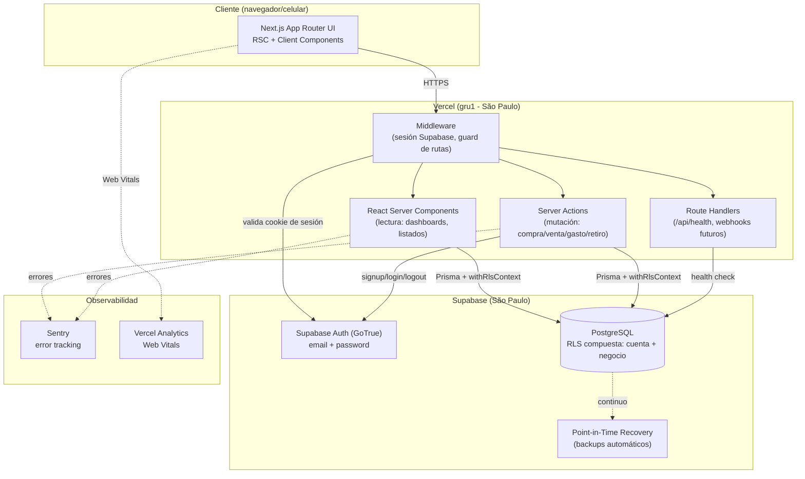
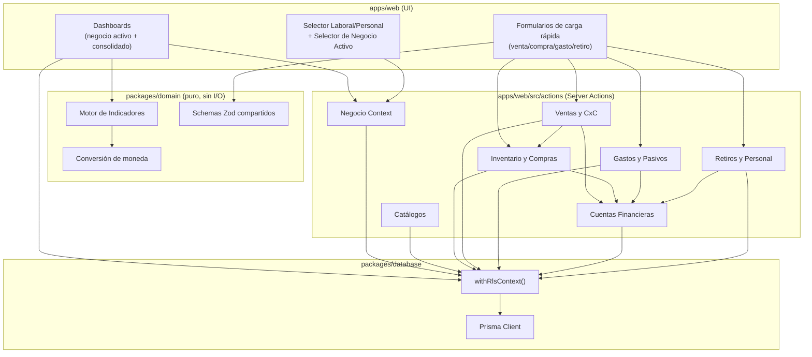
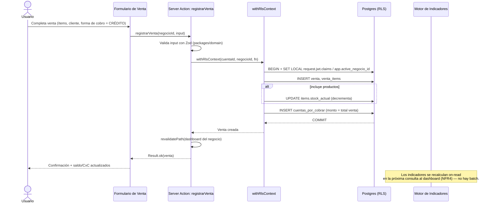
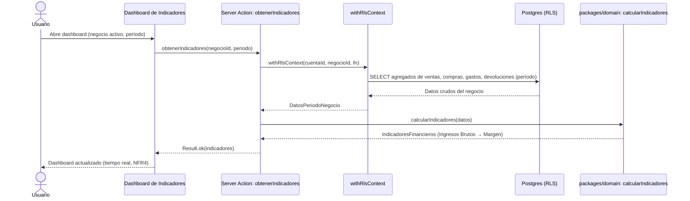
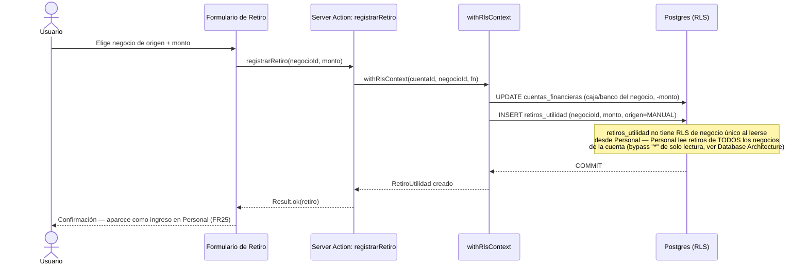
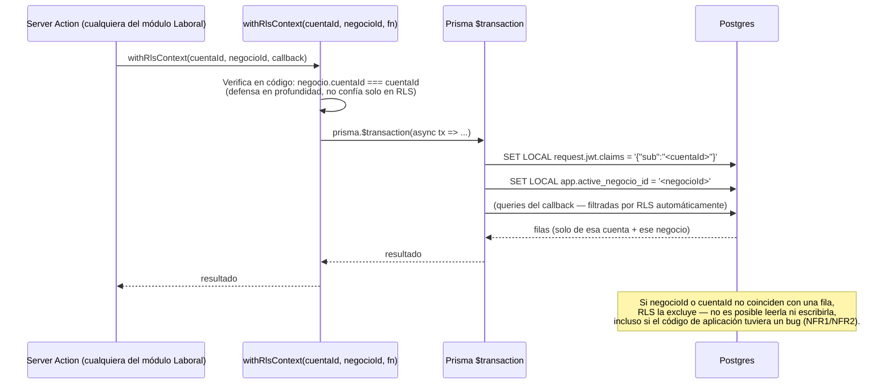
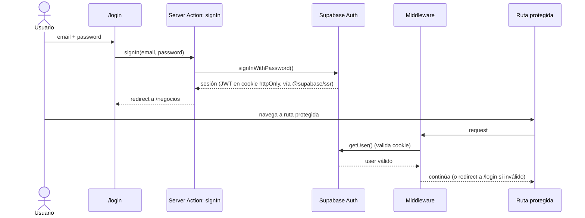
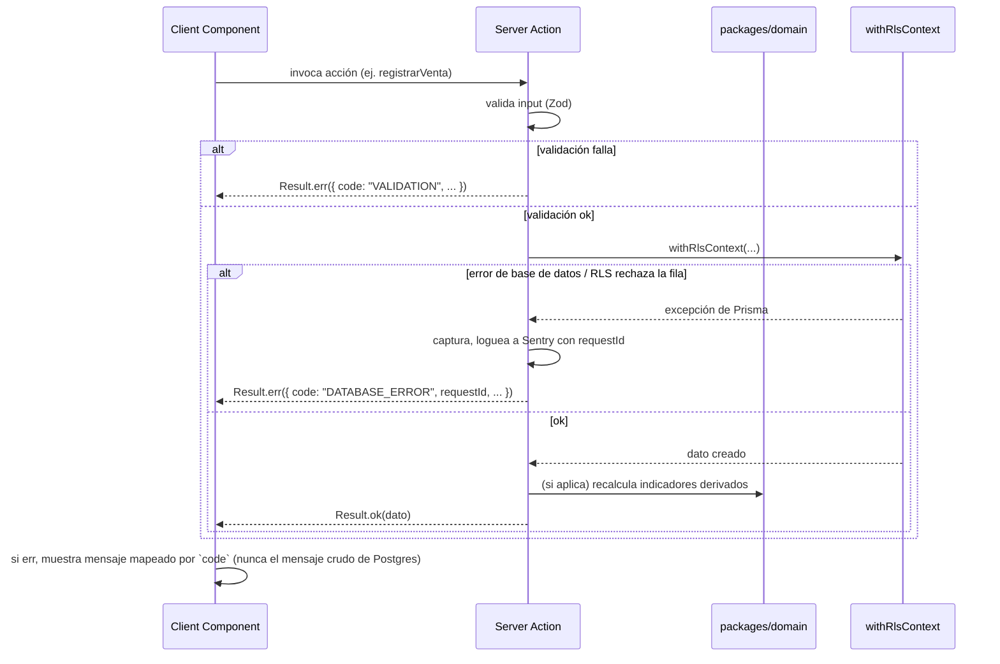

# Money System (Personal + Laboral, Multi-Negocio) — Fullstack Architecture Document

> Nombre de trabajo: `[NOMBRE_PROYECTO]` — placeholder heredado del Project Brief y del PRD, no bloquea el avance (ver `docs/brief.md` y `docs/prd.md`).

---

## Introduction

Este documento define la arquitectura fullstack completa para el Money System: backend, frontend y su integración, como fuente única de verdad para el desarrollo dirigido por agentes de IA (@dev). Unifica lo que tradicionalmente serían un documento de arquitectura backend y uno frontend separados, porque en este proyecto —una única aplicación Next.js con Server Actions— ambas capas están intrínsecamente entrelazadas.

**Documentos de entrada revisados:**
- `docs/prd.md` (v2.3) — 36 Requisitos Funcionales, 11 No Funcionales, 6 Epics, 26 historias. Marcado **READY FOR ARCHITECT**.
- `docs/brief.md` — Project Brief con terminología financiera y mockup de referencia ("Panorama Multi-Moneda").

No existe `docs/front-end-spec.md` todavía (el PRD delega el flujo detallado de UX a `@ux-design-expert`, ejecutado en paralelo/después de esta arquitectura). Donde el PRD deja una decisión técnica abierta, este documento la cierra explícitamente con su razonamiento — no se dejan huecos para @dev.

### Starter Template or Existing Project

**N/A — Proyecto Greenfield.** No hay repositorio git inicializado, no hay starter template ni codebase previo. El PRD fija el preset técnico activo del framework AIOX como punto de partida (`nextjs-react`: Next.js, React, TypeScript, Tailwind, Zustand, React Query), sujeto a validación de este documento. Se valida y se adopta como base (ver Tech Stack), sin usar un starter de terceros (T3, create-t3-app, etc.) — el modelo de datos multi-negocio y el patrón de aislamiento RLS compuesto son suficientemente específicos como para no beneficiarse de un starter genérico, y evitar sus configuraciones/opiniones no solicitadas.

### Change Log

| Date | Version | Description | Author |
|---|---|---|---|
| 2026-08-31 | 1.0 | Arquitectura inicial generada a partir de `docs/prd.md` v2.3 (modo YOLO/autónomo, decisiones técnicas cerradas por @architect con justificación registrada) | Aria (@architect) |

---

## High Level Architecture

### Technical Summary

El sistema es un **monolito modular** implementado como una única aplicación **Next.js 15 (App Router)** con **Server Actions** como capa de mutación primaria, desplegado en **Vercel**, contra una base de datos **PostgreSQL gestionada por Supabase**. Supabase provee además **autenticación** (email/contraseña) y respaldos automáticos. El frontend usa **React Server Components** por defecto y componentes cliente solo donde hay interactividad real (formularios de carga rápida, selector de negocio activo), con **Zustand** para estado de UI efímero (negocio activo, ámbito Laboral/Personal) y **React Query** para estado de servidor (dashboards, listados). El punto de integración crítico entre frontend y backend no es una API REST separada, sino **Server Actions tipadas de extremo a extremo** (mismo `packages/domain` compartido de tipos y validación Zod), lo que elimina una clase entera de bugs de desincronización de contratos. La pieza arquitectónica central que resuelve los NFR1/NFR2 del PRD (aislamiento entre cuentas y entre negocios "a nivel de consulta/base de datos, no solo de interfaz") es un esquema de **Row-Level Security (RLS) compuesta de Postgres**: cada consulta corre dentro de una transacción que fija dos variables de sesión —identidad de cuenta (equivalente a `auth.uid()`) y negocio activo— y las políticas RLS de cada tabla las exigen ambas. Esta arquitectura cumple la promesa central del PRD (indicadores financieros por negocio y consolidados, en tiempo real, sin cálculo manual) manteniendo la superficie operativa mínima adecuada para un producto de uso propio de bajo-medio volumen transaccional.

### Platform and Infrastructure Choice

El PRD fija: monolito modular, Next.js App Router + Server Actions, PostgreSQL relacional con integridad ACID (NFR8), aislamiento a nivel de DB (NFR1/NFR2), backups periódicos (NFR3), autenticación individual (NFR9), sin integraciones de pago ni bancarias. Con esos requisitos, se evaluaron:

| Opción | Pros | Contras |
|---|---|---|
| **Vercel + Supabase** | Soporte nativo de primera clase para Next.js (Server Actions, RSC, edge/regional functions); Postgres gestionado con RLS nativo y `auth.uid()` listo para usar; Auth gestionado con backups automáticos (cubre NFR3 sin trabajo extra); tier gratuito/bajo costo adecuado a volumen bajo-medio; cero overhead operativo para un desarrollador solo. | Vendor lock-in moderado (mitigado: Postgres estándar, se puede migrar); límites de cold-start en el tier gratuito (aceptable, NFR4 pide tiempo real interactivo, no SLA de alta concurrencia). |
| **AWS Full Stack** (Lambda + API Gateway + RDS + Cognito) | Máximo control, escala a nivel empresarial. | Sobreingeniería clara para este volumen; RLS compuesta y `auth.uid()` habría que reconstruirlos a mano sobre Cognito; semanas de setup de infraestructura que el MVP no justifica (violación directa del principio "Pragmatic Technology Selection"). |
| **Railway** (Postgres + Next.js en un solo servicio) | Muy simple, un solo proveedor, Postgres administrado. | Sin RLS/Auth nativos integrados con el framework — habría que construir la capa de autenticación y el mecanismo de `auth.uid()`-equivalente desde cero, replicando trabajo que Supabase ya resuelve. |

**Decisión: Vercel + Supabase.** Es la única opción donde el mecanismo de aislamiento exigido por NFR1/NFR2 (RLS a nivel de base de datos) viene resuelto por la plataforma en vez de construido a mano, y donde el backup de NFR3 es gratis por configuración. Se confirma como elección explícita de este documento — el PRD dejaba esta decisión abierta para @architect.

**Platform:** Vercel (hosting Next.js, Server Actions, funciones regionales) + Supabase (PostgreSQL, Auth, backups)
**Key Services:** Vercel (Edge Network, Serverless/Node Functions), Supabase Postgres, Supabase Auth (GoTrue), Supabase Point-in-Time Recovery (backups)
**Deployment Host and Regions:** Vercel función pineada a `gru1` (São Paulo) — región más cercana a Paraguay disponible en Vercel; proyecto Supabase en la región **South America (São Paulo)** por la misma razón. Minimiza latencia de escritura de transacciones financieras interactivas (NFR10: <1 min por operación).

### Repository Structure

**Structure:** Monorepo (según lo fijado en el PRD — Technical Assumptions), implementado con **npm workspaces**, sin Turborepo/Nx.

**Rationale:** el PRD pide monorepo para "compartir tipos entre validación de formularios y las fórmulas financieras". Como todo el sistema vive en **una sola aplicación Next.js** (no hay un backend separado desplegado aparte — Server Actions corren dentro del mismo proceso Next.js), no hay necesidad de orquestar builds de múltiples apps con Turborepo/Nx: eso sería complejidad de tooling sin un problema real que resolver a este tamaño (principio "Pragmatic Technology Selection" — tecnología aburrida donde alcanza). npm workspaces da exactamente lo que se necesita: paquetes internos (`packages/domain`, `packages/database`) importables desde `apps/web` con TypeScript project references, sin build orchestration adicional. Si el proyecto creciera a múltiples apps desplegables por separado, migrar a Turborepo es un cambio mecánico, no una reescritura.

**Monorepo Tool:** npm workspaces
**Package Organization:**
- `apps/web` — la aplicación Next.js completa (UI + Server Actions + Route Handlers). Es el único artefacto desplegado.
- `packages/domain` — lógica de negocio pura, sin dependencias de framework: fórmulas de indicadores financieros (Story 5.1), conversión de moneda, tipos TypeScript compartidos, esquemas de validación Zod. 100% testeable de forma aislada — exactamente el área que el PRD marca como de mayor riesgo ("Testing Requirements": fórmulas financieras con cobertura exhaustiva de casos límite).
- `packages/database` — schema de Prisma, cliente generado, y la capa de acceso a datos con el wrapper de contexto RLS (`withRlsContext`, ver Backend Architecture).

### High Level Architecture Diagram



### Architectural Patterns

- **Monolito Modular (Modular Monolith):** una única aplicación desplegable, organizada internamente por módulos de dominio (Negocios, Catálogos, Inventario, Ventas, Gastos, Indicadores, Personal) con fronteras de import explícitas. — _Rationale:_ el volumen bajo-medio del brief y el equipo de un solo desarrollador no justifican el costo operativo de microservicios; un monolito bien modularizado da la mayoría de los beneficios de aislamiento sin el costo de una red distribuida.
- **Server Actions como capa de mutación (BFF implícito):** toda escritura (compra, venta, gasto, retiro) pasa por una Server Action tipada, nunca por un cliente HTTP genérico desde el navegador. — _Rationale:_ elimina la necesidad de mantener contratos OpenAPI/tRPC separados; el tipo de la función *es* el contrato, compartido en tiempo de compilación entre UI y backend.
- **RLS Compuesta (Composite Row-Level Security):** aislamiento de datos impuesto por Postgres mediante dos variables de sesión por transacción — identidad de cuenta y negocio activo — no solo por `WHERE` en el código de aplicación. — _Rationale:_ es la única forma de satisfacer literalmente NFR1/NFR2 ("a nivel de consulta/base de datos, no solo de interfaz"); un bug de aplicación que olvide un filtro no puede filtrar datos entre cuentas o negocios, porque Postgres lo rechaza antes de devolver filas.
- **Domain Package Puro (Functional Core):** las fórmulas de indicadores financieros y conversión de moneda viven en `packages/domain`, sin I/O ni dependencias de Next.js/Prisma — reciben datos, devuelven números. — _Rationale:_ es el área de mayor riesgo del PRD; aislarla de infraestructura permite tests unitarios rápidos y exhaustivos de casos límite sin levantar base de datos.
- **Repository Pattern con Contexto Obligatorio:** toda lectura/escritura del módulo Laboral pasa por funciones de `packages/database` que exigen un `negocio_id` de contexto — no existe una ruta de código que consulte una tabla transaccional sin pasar por `withRlsContext`. — _Rationale:_ hace estructuralmente imposible (no solo "por convención") que una Server Action olvide el filtro de negocio.
- **Optimistic UI + Revalidation:** mutaciones vía Server Actions seguidas de `revalidatePath`/`revalidateTag`; React Query gestiona estado de servidor en las vistas que lo necesitan (dashboards con filtros) con `staleTime` corto. — _Rationale:_ NFR4 exige indicadores en tiempo real sin batch nocturno; revalidar por path es más simple que un sistema de eventos para este volumen.

---

## Tech Stack

Esta es la selección definitiva de tecnología para todo el proyecto. Todo desarrollo debe usar exactamente estas versiones (o el rango semver indicado) como única fuente de verdad.

### Technology Stack Table

| Category | Technology | Version | Purpose | Rationale |
|---|---|---|---|---|
| Frontend Language | TypeScript | ^5.7 | Lenguaje de toda la UI | Type-safety compartido de extremo a extremo con Server Actions y `packages/domain`; requisito implícito para el patrón de contrato-por-tipo. |
| Frontend Framework | Next.js (App Router) | ^15.1 | Framework fullstack — UI, Server Actions, routing, RSC | Preset técnico ya fijado en el PRD; App Router + Server Actions es exactamente el "Service Architecture" que el PRD especifica. |
| UI Component Library | shadcn/ui (sobre Radix UI) | latest (copy-in, sin versión de paquete) | Componentes base accesibles (form, dialog, select, table) | No es una dependencia de runtime tradicional — el código se copia al repo, así que no hay versión que fije un límite de personalización. Da accesibilidad (WCAG AA, ver UI Design Goals) y composability sin diseñar un design system desde cero; compatible con Tailwind y con la dirección de branding validada (acento esmeralda, serif + monoespaciada). |
| State Management | Zustand | ^5.0 | Estado de UI global efímero: negocio activo, ámbito Laboral/Personal | Fijado por el PRD (Technical Assumptions). Ideal para el selector de negocio activo (FR5) — estado global simple, sin boilerplate de reducers, persistido en `localStorage` para recordar la última selección. |
| Backend Language | TypeScript | ^5.7 | Lenguaje de Server Actions, Route Handlers y `packages/domain`/`packages/database` | Mismo lenguaje que el frontend — requisito para el patrón de tipos compartidos (Coding Standards). |
| Backend Framework | Next.js Server Actions + Route Handlers | ^15.1 (mismo paquete que frontend) | Capa de mutación y endpoints server-side | No hay backend separado — Server Actions son el "backend" de este monolito modular. Route Handlers solo para casos no cubiertos por Server Actions (health check público de Story 1.1). |
| API Style | Server Actions (RPC tipado) + REST mínimo para health check | — | Contrato de mutación entre UI y servidor | Ver "API Specification" — se documenta por qué no se eligió REST/GraphQL/tRPC como estilo primario. |
| Database | PostgreSQL (Supabase) | 17.x | Almacenamiento transaccional ACID, RLS | Fijado por el PRD (NFR8); Supabase da RLS nativo con `auth.uid()`, requisito central del diseño de aislamiento. |
| ORM | Prisma | ^6.2 | Schema-as-code, migraciones, cliente tipado, motor de queries | Type-safety con la DB al mismo nivel que TypeScript en el resto del stack; soporta transacciones interactivas (`$transaction`) necesarias para el patrón `SET LOCAL` + query de RLS compuesta. |
| Cache | React Query (cache de cliente) — sin cache de servidor dedicado | ^5.62 | Cache de estado de servidor en el navegador (dashboards, listados) | El volumen bajo-medio del brief no justifica una capa de cache de servidor (Redis) para el MVP; Next.js ya cachea RSC/fetches donde aplica. Se revisita si el volumen crece (ver Post-MVP). |
| File Storage | N/A (no requerido en MVP) | — | — | El PRD no pide adjuntar comprobantes/archivos en el MVP; se documenta explícitamente para que @dev no lo asuma. Si se agrega en Fase 2, Supabase Storage es la extensión natural (misma plataforma, mismo RLS). |
| Authentication | Supabase Auth (GoTrue) vía `@supabase/ssr` | latest | Registro/login individual por cuenta, sesión en cookies httpOnly | Es la pieza que hace posible `auth.uid()` en las políticas RLS — no es solo "conveniente", es un requisito estructural del mecanismo de aislamiento elegido (NFR1). |
| Frontend Testing | Vitest + React Testing Library | ^2.1 / ^16.1 | Unit/component tests de UI | Vitest comparte configuración/ESM con el resto del monorepo (un solo test runner para todo, ver Backend Testing) y es más rápido que Jest bajo Next.js 15. |
| Backend Testing | Vitest | ^2.1 | Unit tests de `packages/domain`; integration tests de `packages/database` contra Postgres real | Mismo runner que frontend — reduce superficie de configuración. Los tests de aislamiento (NFR1/NFR2) corren contra una instancia Postgres real con RLS activada, nunca mockeada (ver Testing Strategy — el propio PRD lo exige explícitamente). |
| E2E Testing | Playwright | ^1.49 | Flujos críticos de usuario de extremo a extremo | Estándar de facto para Next.js App Router; soporta multi-tab/multi-sesión, útil para verificar aislamiento entre cuentas desde la UI. |
| Build Tool | Next.js CLI (Turbopack) | incluido en Next.js ^15.1 | Build y dev server | Turbopack es el default de Next 15 — sin configuración adicional. |
| Bundler | Turbopack | incluido en Next.js ^15.1 | Bundling de dev y build | Ídem — parte del framework, no una elección independiente. |
| IaC Tool | N/A (MVP) — configuración vía dashboards de Vercel/Supabase + variables de entorno versionadas en `.env.example` | — | — | A este tamaño (2 servicios gestionados, sin infraestructura propia) una herramienta de IaC (Terraform/Pulumi) agrega ceremonia sin beneficio; se documenta como decisión explícita, no como omisión. Revisitar si se agregan más servicios gestionados. |
| CI/CD | GitHub Actions + Vercel Git Integration | — | Lint, typecheck, tests en cada PR; deploy automático (preview por PR, producción en `main`) | GitHub Actions cubre las validaciones de calidad (lint/typecheck/test) antes de que el código llegue a Vercel; el propio deploy lo maneja el Git Integration nativo de Vercel — no hay que mantener scripts de deploy a mano. |
| Monitoring | Vercel Analytics (Web Vitals) + Sentry (errores) | Sentry ^8 | Observabilidad de performance y errores en producción | Un sistema financiero no puede fallar en silencio — Sentry captura excepciones no manejadas en Server Actions y en el cliente con contexto de usuario (sin PII sensible, ver Security). |
| Logging | `console.*` estructurado (JSON) capturado por Vercel Log Drains | — | Logs de aplicación | El volumen del MVP no justifica un stack de logging dedicado (Pino + Loki/Datadog); Vercel ya persiste y permite buscar logs de función. Revisitar si el volumen de soporte crece. |
| CSS Framework | Tailwind CSS | ^4.0 | Estilos utilitarios, tokens de diseño (acento esmeralda) | Fijado por el PRD (Technical Assumptions); base natural para shadcn/ui. |

---

## Data Models

Los modelos centrales, compartidos entre frontend y backend vía `packages/domain`. La entidad `Negocio` es la pieza intermedia obligatoria entre `Cuenta` y todo el resto (tal como exige el PRD v2.0+). El ámbito **Personal** reutiliza las mismas tablas de catálogo/transacción que el ámbito **Laboral** con `negocio_id = null` y `ambito = 'PERSONAL'`, en vez de duplicar modelos — evita mantener dos veces la misma lógica de gasto/catálogo/saldo con un `ambito` como discriminador explícito.

### Cuenta

**Purpose:** Dueño único de todos los datos del sistema (FR1). Un registro por persona autenticada; su `id` es el mismo UUID que Supabase Auth asigna al usuario, así que `Cuenta` no duplica credenciales — solo extiende metadata de aplicación.

**Key Attributes:**
- id: UUID — igual a `auth.users.id` de Supabase (relación 1:1)
- email: string — espejo de conveniencia del email de Auth
- createdAt: Date — fecha de alta

```typescript
export interface Cuenta {
  id: string;        // UUID, == Supabase auth user id
  email: string;
  createdAt: Date;
}
```

**Relationships:**
- Una `Cuenta` tiene muchos `Negocio` (FR3)
- Una `Cuenta` tiene como máximo una `ReservaFinanciera` (Personal, único por cuenta)

### Negocio

**Purpose:** Unidad de negocio independiente dentro de una cuenta (FR3-FR6). Entidad intermedia obligatoria: toda tabla transaccional o de catálogo del módulo Laboral referencia un `negocioId`.

**Key Attributes:**
- id: UUID
- cuentaId: string — dueño
- nombre: string
- estado: 'ACTIVO' | 'ARCHIVADO' (FR4)
- archivedAt: Date | null

```typescript
export interface Negocio {
  id: string;
  cuentaId: string;
  nombre: string;
  estado: "ACTIVO" | "ARCHIVADO";
  createdAt: Date;
  archivedAt: Date | null;
}
```

**Relationships:**
- Pertenece a una `Cuenta`
- Tiene muchos `Moneda`, `TipoGasto`, `Item`, `CuentaFinanciera`, `Compra`, `Venta`, `Gasto`, `RetiroUtilidad` (todos con `negocioId` obligatorio)

### Moneda

**Purpose:** Catálogo de monedas, independiente por negocio y para Personal (FR7, FR8).

**Key Attributes:**
- id: UUID
- cuentaId, negocioId (null si ámbito Personal)
- ambito: 'LABORAL' | 'PERSONAL'
- codigo: string (ej. "PYG", "USD") — no restringido a ISO-4217 porque el usuario define sus propias monedas (PRD: "monedas definidas por el propio usuario")
- esBase: boolean — Guaraní por defecto en cada ámbito (Story 1.6)
- activa: boolean

```typescript
export interface Moneda {
  id: string;
  cuentaId: string;
  negocioId: string | null;
  ambito: "LABORAL" | "PERSONAL";
  codigo: string;
  nombre: string;
  esBase: boolean;
  activa: boolean;
}
```

**Relationships:**
- Pertenece a un `Negocio` (Laboral) o directamente a una `Cuenta` (Personal, `negocioId = null`)
- Referenciada por `Item`, `CuentaFinanciera`, `Compra`, `Venta`, `Gasto`, `TasaCambio`

### TipoGasto

**Purpose:** Catálogo de tipos de gasto, clasificado obligatoriamente al crearse (FR9, FR10, NFR7).

**Key Attributes:**
- ambito: 'LABORAL' | 'PERSONAL'
- clasificacion: 'OPERATIVO' | 'FINANCIERO' (si Laboral) — 'FIJO' | 'VARIABLE' (si Personal)

```typescript
export type ClasificacionGastoLaboral = "OPERATIVO" | "FINANCIERO";
export type ClasificacionGastoPersonal = "FIJO" | "VARIABLE";

export interface TipoGasto {
  id: string;
  cuentaId: string;
  negocioId: string | null;
  ambito: "LABORAL" | "PERSONAL";
  nombre: string;
  clasificacion: ClasificacionGastoLaboral | ClasificacionGastoPersonal;
}
```

**Relationships:**
- Pertenece a un `Negocio` o a `Cuenta` (Personal)
- Referenciado por `Gasto`

### Item

**Purpose:** Ítem vendible del negocio — Producto (con stock) o Servicio (sin stock) (FR11).

**Key Attributes:**
- tipo: 'PRODUCTO' | 'SERVICIO'
- precioVenta, costoCompra (solo Producto), stockActual (solo Producto)
- tieneMovimientos: boolean — bloquea el cambio de `tipo` una vez que hay compras/ventas asociadas (AC de Story 2.1)

```typescript
export interface Item {
  id: string;
  negocioId: string;
  tipo: "PRODUCTO" | "SERVICIO";
  nombre: string;
  precioVenta: string;       // Decimal serializado — nunca `number` (ver Coding Standards)
  monedaId: string;
  costoCompra: string | null;
  stockActual: string;       // "0" para Servicio, siempre
  tieneMovimientos: boolean;
}
```

**Relationships:**
- Pertenece a un `Negocio`
- Referenciado por `Compra` (solo Producto) y `VentaItem` (Producto o Servicio)

### CuentaFinanciera

**Purpose:** Modelo unificado de Caja, Cuenta Bancaria y Tarjeta de Crédito (FR19, FR20, FR30) — un solo concepto ("medio de pago con saldo/deuda") en vez de tres tablas paralelas con lógica duplicada.

**Key Attributes:**
- tipo: 'CAJA' | 'BANCO' | 'TARJETA'
- saldoActual: decimal — positivo para Caja/Banco, representa deuda (negativo o campo `deuda`) para Tarjeta
- limiteCredito: decimal | null — solo Tarjeta

```typescript
export interface CuentaFinanciera {
  id: string;
  cuentaId: string;
  negocioId: string | null;   // null = Personal
  ambito: "LABORAL" | "PERSONAL";
  tipo: "CAJA" | "BANCO" | "TARJETA";
  nombre: string;
  monedaId: string;
  saldoActual: string;        // Tarjeta: negativo = deuda
  limiteCredito: string | null;
}
```

**Relationships:**
- Pertenece a un `Negocio` o a `Cuenta` (Personal)
- Referenciada como destino/origen por `Compra`, `Venta`, `Gasto`, `PagoCxC`, `MovimientoTarjeta`, `MovimientoCuenta`

### TasaCambio

**Purpose:** Snapshot inmutable de la tasa de cambio manual cargada por el usuario para una moneda no base (FR35, FR36). Cada transacción en moneda distinta a Guaraní queda asociada a la tasa vigente en ese momento — el histórico nunca se recalcula.

```typescript
export interface TasaCambio {
  id: string;
  monedaId: string;
  tasa: string;              // 1 unidad de `monedaId` = `tasa` Guaraníes
  vigenteDesde: Date;
  registradaPor: string;     // cuentaId
}
```

**Relationships:**
- Pertenece a una `Moneda`
- Referenciada (snapshot, no FK viva de "tasa actual") por `Compra.tasaCambioId`, `Venta.tasaCambioId`

### Compra

**Purpose:** Registro de compra de mercadería (FR12) — actualiza stock y saldo/deuda automáticamente.

```typescript
export type FormaPagoCompra = "EFECTIVO" | "BANCO" | "TARJETA" | "CREDITO_PROVEEDOR";

export interface Compra {
  id: string;
  negocioId: string;
  itemId: string;
  costoUnitario: string;
  cantidad: string;
  fecha: Date;
  proveedor: string | null;
  formaPago: FormaPagoCompra;
  cuentaFinancieraId: string | null;  // null solo si CREDITO_PROVEEDOR
  monedaId: string;
  tasaCambioId: string | null;        // null si moneda == base
}
```

**Relationships:** Pertenece a `Negocio` e `Item`; afecta `CuentaFinanciera` (saldo) o genera deuda de tarjeta (`MovimientoTarjeta`).

### Venta / VentaItem

**Purpose:** Venta compuesta por uno o más ítems (FR14), con cancelación/devolución total o parcial (FR16).

```typescript
export type FormaCobro = "EFECTIVO" | "BANCO" | "TARJETA" | "CREDITO_CLIENTE";
export type EstadoVenta = "ACTIVA" | "CANCELADA" | "DEVUELTA_PARCIAL";

export interface Venta {
  id: string;
  negocioId: string;
  cliente: string | null;
  fecha: Date;
  formaCobro: FormaCobro;
  impuesto: string;           // monto de impuesto aplicado, alimenta Ingresos Netos
  estado: EstadoVenta;
  cuentaFinancieraId: string | null; // null si CREDITO_CLIENTE (ver CuentaPorCobrar)
  monedaId: string;
  tasaCambioId: string | null;
}

export interface VentaItem {
  id: string;
  ventaId: string;
  itemId: string;
  cantidad: string | null;    // null para Servicio sin cantidad explícita
  precioUnitario: string;
  costoServicio: string | null;  // solo Servicio (FR15) — null tratado como 0 y señalado (AC Story 3.2)
  cantidadDevuelta: string;   // acumulador de devoluciones parciales
}
```

**Relationships:** `Venta` pertenece a `Negocio`; tiene muchos `VentaItem`; puede generar una `CuentaPorCobrar`.

### CuentaPorCobrar / PagoCxC

**Purpose:** Deuda de cliente hacia el negocio por ventas a crédito (FR17), con pagos totales/parciales.

```typescript
export type EstadoCxC = "PENDIENTE" | "PARCIAL" | "PAGADO";

export interface CuentaPorCobrar {
  id: string;
  negocioId: string;
  ventaId: string;
  cliente: string;
  montoOriginal: string;
  montoPagado: string;
  estado: EstadoCxC;
}

export interface PagoCxC {
  id: string;
  cuentaPorCobrarId: string;
  monto: string;
  fecha: Date;
  cuentaFinancieraId: string;  // dónde entró el cobro
}
```

### Gasto

**Purpose:** Gasto clasificado, Laboral (en el negocio activo) o Personal (FR18, FR28, FR29).

```typescript
export type FormaPagoGasto = "EFECTIVO" | "BANCO" | "TARJETA";

export interface Gasto {
  id: string;
  cuentaId: string;
  negocioId: string | null;   // null = Personal
  ambito: "LABORAL" | "PERSONAL";
  tipoGastoId: string;
  monto: string;
  monedaId: string;
  fecha: Date;
  formaPago: FormaPagoGasto;
  cuentaFinancieraId: string;
}
```

### MovimientoTarjeta / MovimientoCuenta

**Purpose:** Ledger append-only de cada cambio de saldo/deuda — `CuentaFinanciera.saldoActual` es un valor denormalizado reconciliable desde estos movimientos, no la única fuente de verdad. Da auditabilidad (útil para debug de discrepancias) sin costo de complejidad para el usuario final.

```typescript
export interface MovimientoTarjeta {
  id: string;
  cuentaFinancieraId: string;  // debe ser tipo TARJETA
  tipo: "CONSUMO" | "PAGO_RESUMEN" | "INTERES";
  monto: string;
  fecha: Date;
  referenciaTipo: "COMPRA" | "GASTO" | "MANUAL" | null;
  referenciaId: string | null;
}

export interface MovimientoCuenta {
  id: string;
  cuentaFinancieraId: string;  // tipo CAJA o BANCO
  tipo: "INGRESO" | "EGRESO";
  monto: string;
  fecha: Date;
  referenciaTipo: "COMPRA" | "VENTA" | "GASTO" | "PAGO_CXC" | "RETIRO" | "MANUAL" | null;
  referenciaId: string | null;
}
```

### RetiroUtilidad / ReglaRetiro

**Purpose:** Puente explícito entre un negocio y Personal (FR25-FR27) — manual o por regla predeterminada (FR26).

```typescript
export type TipoRegla = "PORCENTAJE" | "MONTO_FIJO";

export interface ReglaRetiro {
  id: string;
  negocioId: string;          // único por negocio
  tipo: TipoRegla;
  valor: string;
  periodo: "MENSUAL";
  activa: boolean;
}

export interface RetiroUtilidad {
  id: string;
  negocioId: string;
  monto: string;
  fecha: Date;
  origen: "MANUAL" | "REGLA";
  reglaId: string | null;
}
```

### ReservaFinanciera

**Purpose:** Objetivo de ahorro personal y progreso acumulado (FR31), único por cuenta.

```typescript
export interface ReservaFinanciera {
  id: string;
  cuentaId: string;            // único
  objetivoMonto: string;
  aportePorPeriodo: string;
  periodo: "MENSUAL";
  progresoAcumulado: string;
}
```

---

## API Specification

**No se eligió REST/GraphQL/tRPC como estilo primario.** El estilo de API es **Server Actions de Next.js** para toda mutación de dominio, más un único **Route Handler REST mínimo** para el health check público de Story 1.1 (que por definición no puede requerir autenticación ni pasar por una Server Action ligada a sesión).

**Rationale de la elección:**
- Todo el sistema corre en un único proceso Next.js — no hay un cliente externo (app móvil nativa, integración de terceros) que necesite un contrato HTTP documentado formalmente. El PRD confirma explícitamente que no hay integraciones externas en el MVP.
- Server Actions dan tipado de extremo a extremo gratis (la firma de la función es el contrato) sin mantener un schema OpenAPI o GraphQL en paralelo que se puede desincronizar del código real.
- Si en el futuro se necesita exponer una API pública (app móvil, integraciones), se puede envolver la misma capa `packages/domain`/`packages/database` en Route Handlers REST sin reescribir lógica de negocio — la decisión no cierra esa puerta.

### Convención de Server Actions

Cada Server Action:
1. Se ubica en `apps/web/src/actions/<dominio>/<accion>.ts` (ej. `actions/ventas/registrar-venta.ts`).
2. Valida su input con un schema Zod definido en `packages/domain` (compartido con la validación de formularios del cliente).
3. Resuelve la cuenta autenticada desde la sesión de Supabase (vía middleware) y el negocio activo desde el argumento explícito recibido de la UI — nunca de una cookie implícita, para que el aislamiento sea auditable en el código de la propia función.
4. Ejecuta la operación dentro de `withRlsContext(cuentaId, negocioId, fn)` (ver Backend Architecture).
5. Devuelve un `Result<T, ApiError>` tipado (ver Error Handling Strategy) — nunca lanza excepciones no controladas hacia el cliente.

**Firmas representativas** (contrato, no implementación):

```typescript
// actions/ventas/registrar-venta.ts
export async function registrarVenta(
  negocioId: string,
  input: RegistrarVentaInput   // Zod-inferred desde packages/domain
): Promise<Result<Venta, ApiError>>;

// actions/negocios/crear-negocio.ts
export async function crearNegocio(
  input: CrearNegocioInput
): Promise<Result<Negocio, ApiError>>;

// actions/indicadores/obtener-indicadores.ts
export async function obtenerIndicadores(
  negocioId: string,
  periodo: PeriodoFiltro
): Promise<Result<IndicadoresFinancieros, ApiError>>;

// actions/consolidado/obtener-dashboard-consolidado.ts
export async function obtenerDashboardConsolidado(
  periodo: PeriodoFiltro
): Promise<Result<DashboardConsolidado, ApiError>>;   // única acción que usa el bypass "*" de negocio (ver Database Architecture)
```

### Route Handler — Health Check (único endpoint REST)

```yaml
openapi: 3.0.0
info:
  title: Money System — Health Check
  version: 1.0.0
  description: Único endpoint HTTP público del sistema; confirma que la app y la base de datos están operativas (Story 1.1, AC2).
servers:
  - url: /api
    description: Mismo origen que la app Next.js
paths:
  /health:
    get:
      summary: Estado del sistema
      security: []   # sin autenticación, por diseño (AC2 de Story 1.1)
      responses:
        "200":
          description: Sistema y base de datos operativos
          content:
            application/json:
              schema:
                type: object
                properties:
                  status: { type: string, enum: [ok] }
                  database: { type: string, enum: [connected] }
                  timestamp: { type: string, format: date-time }
        "503":
          description: Base de datos no responde
```

---

## Components

### Auth & Session

**Responsibility:** Registro, login, logout, gestión de sesión (FR1, FR2, NFR9). Wrapper delgado sobre Supabase Auth vía `@supabase/ssr`.

**Key Interfaces:**
- `signUp(email, password)`, `signIn(email, password)`, `signOut()`
- `getCurrentAccount()` — resuelve la `Cuenta` autenticada desde la cookie de sesión

**Dependencies:** Supabase Auth
**Technology Stack:** `@supabase/ssr` + Next.js Middleware

### Negocio Context

**Responsibility:** Gestión de negocios (alta, archivo, selector activo — FR3-FR6) y resolución del `negocioId` activo por request.

**Key Interfaces:**
- `crearNegocio`, `archivarNegocio`, `listarNegocios`
- Store de Zustand `useNegocioActivoStore` (persistido en `localStorage`) — fuente de verdad de UI para qué negocio está seleccionado

**Dependencies:** Auth & Session, Database Access Layer
**Technology Stack:** Server Actions + Zustand

### Catálogos (Monedas / Tipos de Gasto)

**Responsibility:** CRUD de los dos catálogos configurables por negocio y Personal (FR7-FR10), con la clasificación obligatoria (NFR7).

**Dependencies:** Negocio Context
**Technology Stack:** Server Actions + Prisma

### Inventario y Compras

**Responsibility:** Alta de ítems (Producto/Servicio), registro de compras, mantenimiento de stock valorizado (FR11-FR13, Epic 2).

**Key Interfaces:** `crearItem`, `registrarCompra`, `obtenerValorInventario`
**Dependencies:** Catálogos (moneda), Cuentas Financieras (saldo/deuda de tarjeta)

### Ventas y Cuentas por Cobrar

**Responsibility:** Registro de ventas mixtas producto/servicio, cancelaciones/devoluciones, cuentas por cobrar (Epic 3).

**Key Interfaces:** `registrarVenta`, `cancelarVenta`, `registrarPagoCxC`
**Dependencies:** Inventario (stock), Cuentas Financieras, Motor de Indicadores (consumidor de sus eventos)

### Gastos y Pasivos

**Responsibility:** Registro de gastos clasificados, deuda de tarjeta/cuentas por pagar (Epic 4).

**Key Interfaces:** `registrarGasto`, `registrarPagoResumenTarjeta`
**Dependencies:** Catálogos (tipo de gasto), Cuentas Financieras

### Cuentas Financieras (Caja/Banco/Tarjeta)

**Responsibility:** Saldo/deuda por cuenta financiera y por moneda (FR19, FR20, FR33), ledger de movimientos.

**Key Interfaces:** `obtenerSaldos`, `crearCuentaFinanciera`
**Dependencies:** Catálogos (moneda)
**Nota:** es el componente más "compartido" — casi todos los demás lo invocan para mover saldo. Se diseña con una única función de escritura (`aplicarMovimiento`) para que el ledger sea siempre la única vía de mutación de saldo, evitando estados inconsistentes.

### Motor de Indicadores (Financial Engine)

**Responsibility:** Cálculo de la cadena completa de indicadores (Story 5.1) y consolidación multi-negocio/multi-moneda (Story 5.4). **Vive en `packages/domain` como funciones puras** — no toca la base de datos directamente, recibe los datos ya leídos y devuelve los indicadores calculados.

**Key Interfaces:**
```typescript
calcularIndicadores(datos: DatosPeriodoNegocio): IndicadoresFinancieros;
consolidarIndicadores(indicadoresPorNegocio: IndicadoresFinancieros[], tasas: TasaCambio[]): IndicadoresConsolidados;
convertirAMoneda(monto: string, tasaCambio: TasaCambio | null): string;
```

**Dependencies:** ninguna de infraestructura (por diseño — ver "Architectural Patterns: Domain Package Puro")
**Technology Stack:** TypeScript puro, testeado con Vitest (mayor densidad de tests unitarios de todo el sistema)

### Retiros y Módulo Personal

**Responsibility:** Puente Negocio → Personal (retiro manual y regla predeterminada, FR25-FR27), gastos personales, tarjeta personal, reserva financiera, balance personal (Epic 6).

**Dependencies:** Cuentas Financieras (de ambos ámbitos), Motor de Indicadores (ganancia líquida disponible para retiro)

### Component Diagrams



---

## External APIs

**Ninguna requerida en el MVP.** El PRD cierra explícitamente este punto: no hay integración de pagos, no hay integración bancaria, y la tasa de cambio se carga **100% manualmente por el usuario** (FR36, decisión ya cerrada en el Change Log del PRD v2.2) — no hay fuente externa automática de tipo de cambio en esta fase. Se documenta explícitamente para que @dev no la asuma ni la implemente por iniciativa propia. La única extensión prevista para Fase 2 (fuera de alcance de este documento) sería una fuente automática de tasa de cambio, mencionada como mejora futura en `docs/brief.md`.

---

## Core Workflows

### Registro de venta a crédito (con actualización de stock, CxC y saldo)



### Cálculo de indicadores financieros (lectura, negocio activo)



### Retiro de utilidades (negocio → Personal)



### Contexto de aislamiento por request (negocio + cuenta)



---

## Database Schema

PostgreSQL 17 (Supabase). Todas las tablas usan `id uuid default gen_random_uuid()` y quedan bajo RLS. Se muestra el esquema completo de las tablas centrales; los mismos patrones de RLS/índices se replican en el resto (omitidas por espacio: `movimiento_tarjeta`, `pagos_cxc`, `regla_retiro`, `reserva_financiera` siguen exactamente el mismo patrón que sus pares mostradas).

```sql
-- ============================================================
-- EXTENSIONES Y ROL DE APLICACIÓN
-- ============================================================
create extension if not exists "pgcrypto";  -- gen_random_uuid()

-- Rol de runtime SIN bypass de RLS — Prisma se conecta con este rol,
-- nunca con `postgres` (superuser) ni `service_role` (ambos bypasean RLS).
create role app_user with login password '<gestionado por variable de entorno>' nobypassrls;

-- ============================================================
-- CUENTA (extiende auth.users de Supabase — no duplica credenciales)
-- ============================================================
create table cuentas (
  id          uuid primary key references auth.users(id) on delete cascade,
  email       text not null,
  created_at  timestamptz not null default now()
);
alter table cuentas enable row level security;
create policy cuentas_isolation on cuentas
  using (id = auth.uid());

-- ============================================================
-- NEGOCIOS
-- ============================================================
create table negocios (
  id           uuid primary key default gen_random_uuid(),
  cuenta_id    uuid not null references cuentas(id) on delete cascade,
  nombre       text not null,
  estado       text not null default 'ACTIVO' check (estado in ('ACTIVO','ARCHIVADO')),
  created_at   timestamptz not null default now(),
  archived_at  timestamptz
);
create index idx_negocios_cuenta on negocios(cuenta_id);
alter table negocios enable row level security;
create policy negocios_isolation on negocios
  using (cuenta_id = auth.uid());

-- ============================================================
-- MONEDAS (Laboral por negocio / Personal por cuenta)
-- ============================================================
create table monedas (
  id          uuid primary key default gen_random_uuid(),
  cuenta_id   uuid not null references cuentas(id) on delete cascade,
  negocio_id  uuid references negocios(id) on delete cascade,
  ambito      text not null check (ambito in ('LABORAL','PERSONAL')),
  codigo      text not null,
  nombre      text not null,
  es_base     boolean not null default false,
  activa      boolean not null default true,
  created_at  timestamptz not null default now(),
  constraint chk_moneda_ambito check (
    (ambito = 'PERSONAL' and negocio_id is null) or
    (ambito = 'LABORAL'  and negocio_id is not null)
  )
);
create unique index uq_moneda_laboral on monedas(negocio_id, codigo) where ambito = 'LABORAL';
create unique index uq_moneda_personal on monedas(cuenta_id, codigo) where ambito = 'PERSONAL';
alter table monedas enable row level security;
create policy monedas_isolation on monedas
  using (
    cuenta_id = auth.uid()
    and (
      negocio_id is null  -- Personal: solo requiere cuenta
      or negocio_id = nullif(current_setting('app.active_negocio_id', true), '')::uuid
      or current_setting('app.active_negocio_id', true) = '*'  -- lectura consolidada, ver nota abajo
    )
  );

-- ============================================================
-- TIPOS DE GASTO
-- ============================================================
create table tipos_gasto (
  id             uuid primary key default gen_random_uuid(),
  cuenta_id      uuid not null references cuentas(id) on delete cascade,
  negocio_id     uuid references negocios(id) on delete cascade,
  ambito         text not null check (ambito in ('LABORAL','PERSONAL')),
  nombre         text not null,
  clasificacion  text not null,
  created_at     timestamptz not null default now(),
  constraint chk_tipo_gasto_ambito check (
    (ambito = 'PERSONAL' and negocio_id is null and clasificacion in ('FIJO','VARIABLE')) or
    (ambito = 'LABORAL'  and negocio_id is not null and clasificacion in ('OPERATIVO','FINANCIERO'))
  )
);
alter table tipos_gasto enable row level security;
create policy tipos_gasto_isolation on tipos_gasto
  using (
    cuenta_id = auth.uid()
    and (negocio_id is null
         or negocio_id = nullif(current_setting('app.active_negocio_id', true), '')::uuid
         or current_setting('app.active_negocio_id', true) = '*')
  );

-- ============================================================
-- ITEMS (Producto / Servicio)
-- ============================================================
create table items (
  id                uuid primary key default gen_random_uuid(),
  negocio_id        uuid not null references negocios(id) on delete cascade,
  cuenta_id         uuid not null references cuentas(id) on delete cascade,  -- denormalizado para RLS directo
  tipo              text not null check (tipo in ('PRODUCTO','SERVICIO')),
  nombre            text not null,
  precio_venta      numeric(18,4) not null check (precio_venta >= 0),
  moneda_id         uuid not null references monedas(id),
  costo_compra      numeric(18,4) check (costo_compra >= 0),
  stock_actual      numeric(18,4) not null default 0,
  tiene_movimientos boolean not null default false,
  created_at        timestamptz not null default now(),
  constraint chk_item_servicio_sin_stock check (tipo = 'PRODUCTO' or stock_actual = 0)
);
create index idx_items_negocio on items(negocio_id);
alter table items enable row level security;
create policy items_isolation on items
  using (
    cuenta_id = auth.uid()
    and (negocio_id = nullif(current_setting('app.active_negocio_id', true), '')::uuid
         or current_setting('app.active_negocio_id', true) = '*')
  );

-- ============================================================
-- CUENTAS FINANCIERAS (Caja / Banco / Tarjeta — unificado)
-- ============================================================
create table cuentas_financieras (
  id              uuid primary key default gen_random_uuid(),
  cuenta_id       uuid not null references cuentas(id) on delete cascade,
  negocio_id      uuid references negocios(id) on delete cascade,
  ambito          text not null check (ambito in ('LABORAL','PERSONAL')),
  tipo            text not null check (tipo in ('CAJA','BANCO','TARJETA')),
  nombre          text not null,
  moneda_id       uuid not null references monedas(id),
  saldo_actual    numeric(18,4) not null default 0,
  limite_credito  numeric(18,4),
  created_at      timestamptz not null default now(),
  constraint chk_cta_fin_ambito check (
    (ambito = 'PERSONAL' and negocio_id is null) or
    (ambito = 'LABORAL'  and negocio_id is not null)
  )
);
alter table cuentas_financieras enable row level security;
create policy cuentas_financieras_isolation on cuentas_financieras
  using (
    cuenta_id = auth.uid()
    and (negocio_id is null
         or negocio_id = nullif(current_setting('app.active_negocio_id', true), '')::uuid
         or current_setting('app.active_negocio_id', true) = '*')
  );

-- ============================================================
-- TASAS DE CAMBIO (snapshot inmutable — FR35)
-- ============================================================
create table tasas_cambio (
  id              uuid primary key default gen_random_uuid(),
  moneda_id       uuid not null references monedas(id) on delete cascade,
  tasa            numeric(18,6) not null check (tasa > 0),
  vigente_desde   timestamptz not null default now(),
  registrada_por  uuid not null references cuentas(id),
  created_at      timestamptz not null default now()
);
create index idx_tasas_moneda_vigencia on tasas_cambio(moneda_id, vigente_desde desc);
alter table tasas_cambio enable row level security;
create policy tasas_cambio_isolation on tasas_cambio
  using (registrada_por = auth.uid());  -- moneda ya está aislada aguas arriba; se refuerza por dueño

-- ============================================================
-- COMPRAS
-- ============================================================
create table compras (
  id                  uuid primary key default gen_random_uuid(),
  negocio_id          uuid not null references negocios(id) on delete cascade,
  cuenta_id           uuid not null references cuentas(id) on delete cascade,
  item_id             uuid not null references items(id),
  costo_unitario      numeric(18,4) not null check (costo_unitario >= 0),
  cantidad            numeric(18,4) not null check (cantidad > 0),
  fecha               date not null default current_date,
  proveedor           text,
  forma_pago          text not null check (forma_pago in ('EFECTIVO','BANCO','TARJETA','CREDITO_PROVEEDOR')),
  cuenta_financiera_id uuid references cuentas_financieras(id),
  moneda_id           uuid not null references monedas(id),
  tasa_cambio_id      uuid references tasas_cambio(id),
  created_at          timestamptz not null default now(),
  constraint chk_compra_medio_pago check (
    (forma_pago = 'CREDITO_PROVEEDOR' and cuenta_financiera_id is null) or
    (forma_pago <> 'CREDITO_PROVEEDOR' and cuenta_financiera_id is not null)
  )
);
create index idx_compras_negocio_fecha on compras(negocio_id, fecha desc);
alter table compras enable row level security;
create policy compras_isolation on compras
  using (
    cuenta_id = auth.uid()
    and (negocio_id = nullif(current_setting('app.active_negocio_id', true), '')::uuid
         or current_setting('app.active_negocio_id', true) = '*')
  );

-- ============================================================
-- VENTAS + VENTA_ITEMS
-- ============================================================
create table ventas (
  id                  uuid primary key default gen_random_uuid(),
  negocio_id          uuid not null references negocios(id) on delete cascade,
  cuenta_id           uuid not null references cuentas(id) on delete cascade,
  cliente             text,
  fecha               date not null default current_date,
  forma_cobro         text not null check (forma_cobro in ('EFECTIVO','BANCO','TARJETA','CREDITO_CLIENTE')),
  impuesto            numeric(18,4) not null default 0,
  estado              text not null default 'ACTIVA' check (estado in ('ACTIVA','CANCELADA','DEVUELTA_PARCIAL')),
  cuenta_financiera_id uuid references cuentas_financieras(id),
  moneda_id           uuid not null references monedas(id),
  tasa_cambio_id      uuid references tasas_cambio(id),
  created_at          timestamptz not null default now()
);
create index idx_ventas_negocio_fecha on ventas(negocio_id, fecha desc);
alter table ventas enable row level security;
create policy ventas_isolation on ventas
  using (
    cuenta_id = auth.uid()
    and (negocio_id = nullif(current_setting('app.active_negocio_id', true), '')::uuid
         or current_setting('app.active_negocio_id', true) = '*')
  );

create table venta_items (
  id                 uuid primary key default gen_random_uuid(),
  venta_id           uuid not null references ventas(id) on delete cascade,
  item_id            uuid not null references items(id),
  cantidad           numeric(18,4),
  precio_unitario    numeric(18,4) not null check (precio_unitario >= 0),
  costo_servicio     numeric(18,4),
  cantidad_devuelta  numeric(18,4) not null default 0
);
alter table venta_items enable row level security;
create policy venta_items_isolation on venta_items
  using (exists (
    select 1 from ventas v where v.id = venta_items.venta_id and v.cuenta_id = auth.uid()
    and (v.negocio_id = nullif(current_setting('app.active_negocio_id', true), '')::uuid
         or current_setting('app.active_negocio_id', true) = '*')
  ));

-- ============================================================
-- CUENTAS POR COBRAR
-- ============================================================
create table cuentas_por_cobrar (
  id             uuid primary key default gen_random_uuid(),
  negocio_id     uuid not null references negocios(id) on delete cascade,
  cuenta_id      uuid not null references cuentas(id) on delete cascade,
  venta_id       uuid not null references ventas(id),
  cliente        text not null,
  monto_original numeric(18,4) not null check (monto_original >= 0),
  monto_pagado   numeric(18,4) not null default 0,
  estado         text not null default 'PENDIENTE' check (estado in ('PENDIENTE','PARCIAL','PAGADO')),
  created_at     timestamptz not null default now()
);
create index idx_cxc_negocio_estado on cuentas_por_cobrar(negocio_id, estado);
alter table cuentas_por_cobrar enable row level security;
create policy cxc_isolation on cuentas_por_cobrar
  using (
    cuenta_id = auth.uid()
    and (negocio_id = nullif(current_setting('app.active_negocio_id', true), '')::uuid
         or current_setting('app.active_negocio_id', true) = '*')
  );

-- ============================================================
-- GASTOS
-- ============================================================
create table gastos (
  id                   uuid primary key default gen_random_uuid(),
  cuenta_id            uuid not null references cuentas(id) on delete cascade,
  negocio_id           uuid references negocios(id) on delete cascade,
  ambito               text not null check (ambito in ('LABORAL','PERSONAL')),
  tipo_gasto_id        uuid not null references tipos_gasto(id),
  monto                numeric(18,4) not null check (monto > 0),
  moneda_id            uuid not null references monedas(id),
  fecha                date not null default current_date,
  forma_pago           text not null check (forma_pago in ('EFECTIVO','BANCO','TARJETA')),
  cuenta_financiera_id uuid not null references cuentas_financieras(id),
  created_at           timestamptz not null default now(),
  constraint chk_gasto_ambito check (
    (ambito = 'PERSONAL' and negocio_id is null) or
    (ambito = 'LABORAL'  and negocio_id is not null)
  )
);
create index idx_gastos_negocio_fecha on gastos(negocio_id, fecha desc);
alter table gastos enable row level security;
create policy gastos_isolation on gastos
  using (
    cuenta_id = auth.uid()
    and (negocio_id is null
         or negocio_id = nullif(current_setting('app.active_negocio_id', true), '')::uuid
         or current_setting('app.active_negocio_id', true) = '*')
  );

-- ============================================================
-- LEDGER DE CUENTA (Caja/Banco)
-- ============================================================
create table movimientos_cuenta (
  id                   uuid primary key default gen_random_uuid(),
  cuenta_financiera_id uuid not null references cuentas_financieras(id) on delete cascade,
  tipo                 text not null check (tipo in ('INGRESO','EGRESO')),
  monto                numeric(18,4) not null check (monto > 0),
  fecha                date not null default current_date,
  referencia_tipo      text,
  referencia_id        uuid,
  created_at           timestamptz not null default now()
);
create index idx_mov_cuenta_cta on movimientos_cuenta(cuenta_financiera_id, fecha desc);
alter table movimientos_cuenta enable row level security;
create policy movimientos_cuenta_isolation on movimientos_cuenta
  using (exists (
    select 1 from cuentas_financieras cf
    where cf.id = movimientos_cuenta.cuenta_financiera_id and cf.cuenta_id = auth.uid()
    and (cf.negocio_id is null
         or cf.negocio_id = nullif(current_setting('app.active_negocio_id', true), '')::uuid
         or current_setting('app.active_negocio_id', true) = '*')
  ));

-- ============================================================
-- RETIROS DE UTILIDAD
-- ============================================================
create table retiros_utilidad (
  id          uuid primary key default gen_random_uuid(),
  negocio_id  uuid not null references negocios(id) on delete cascade,
  cuenta_id   uuid not null references cuentas(id) on delete cascade,
  monto       numeric(18,4) not null check (monto > 0),
  fecha       date not null default current_date,
  origen      text not null check (origen in ('MANUAL','REGLA')),
  regla_id    uuid,
  created_at  timestamptz not null default now()
);
alter table retiros_utilidad enable row level security;
-- Nota: a diferencia de las demás tablas Laborales, Personal necesita leer
-- retiros de TODOS los negocios de la cuenta (FR25: "identificado con su
-- negocio de origen" en el módulo Personal). Por eso esta policy NO exige
-- coincidencia de negocio_id para SELECT — solo para el resto de tablas.
create policy retiros_isolation on retiros_utilidad
  using (cuenta_id = auth.uid());
```

**Notas de diseño transversales al esquema:**

1. **Ledger vs. saldo denormalizado:** `cuentas_financieras.saldo_actual` se actualiza en la misma transacción que cada `INSERT` a `movimientos_cuenta`/`movimientos_tarjeta` (vía la función de aplicación `aplicarMovimiento`, no vía trigger de Postgres — se mantiene la lógica en `packages/database` para que sea testeable con Vitest sin depender de comportamiento de trigger). El ledger es la fuente de verdad auditable; el saldo denormalizado es una proyección para lectura rápida.
2. **`retiros_utilidad` es la única tabla con RLS de negocio "relajada" a propósito** — está documentado explícitamente en el propio SQL para que no se lea como un descuido de copy-paste en una futura revisión.
3. **Bypass `'*'` de `app.active_negocio_id`:** se usa exclusivamente en la Server Action de solo lectura `obtenerDashboardConsolidado` (Story 5.4). Es responsabilidad de **Coding Standards** (ver abajo) que ninguna Server Action de escritura pueda fijar ese valor — se aplica en código, no en RLS, porque RLS no puede distinguir "intención de lectura" de "intención de escritura" dentro de la misma policy `USING`. Se refuerza con revisión de CodeRabbit sobre cualquier PR que toque `withRlsContext`.

---

## Frontend Architecture

### Component Architecture

**Component Organization:**
```text
apps/web/src/
├── app/
│   ├── (auth)/
│   │   ├── login/page.tsx
│   │   └── registro/page.tsx
│   ├── (app)/
│   │   ├── layout.tsx                 # incluye Selector Laboral/Personal + Selector de Negocio
│   │   ├── negocios/page.tsx          # gestión de negocios (Story 1.4)
│   │   ├── laboral/
│   │   │   ├── dashboard/page.tsx     # indicadores del negocio activo (Story 5.1-5.2)
│   │   │   ├── catalogo/page.tsx      # ítems (Story 2.1)
│   │   │   ├── compras/page.tsx
│   │   │   ├── ventas/page.tsx
│   │   │   ├── cuentas-por-cobrar/page.tsx
│   │   │   ├── gastos/page.tsx
│   │   │   ├── tarjeta/page.tsx
│   │   │   └── configuracion/page.tsx # catálogos moneda/tipo-gasto
│   │   ├── personal/
│   │   │   ├── balance/page.tsx
│   │   │   ├── gastos/page.tsx
│   │   │   ├── reserva/page.tsx
│   │   │   └── tarjeta/page.tsx
│   │   └── consolidado/page.tsx       # dashboard consolidado (Story 5.4)
│   └── api/health/route.ts
├── actions/                           # Server Actions, organizadas por dominio (ver API Specification)
├── components/
│   ├── ui/                            # shadcn/ui (copiado, no editado a mano salvo tokens)
│   ├── forms/                         # formularios de carga rápida (venta/compra/gasto/retiro)
│   └── dashboard/                     # tarjetas de indicador, gráficos, tablas
├── stores/
│   └── negocio-activo.store.ts        # Zustand — negocio activo + ámbito
└── lib/
    └── supabase/                      # clientes server/browser de @supabase/ssr
```

**Component Template:**
```typescript
// components/forms/registrar-venta-form.tsx
"use client";

import { useNegocioActivoStore } from "@/stores/negocio-activo.store";
import { registrarVenta } from "@/actions/ventas/registrar-venta";
import { registrarVentaSchema } from "@repo/domain/schemas";

export function RegistrarVentaForm() {
  const negocioId = useNegocioActivoStore((s) => s.negocioActivoId);
  // react-hook-form + zodResolver(registrarVentaSchema) — mismo schema
  // que valida en el servidor dentro de la Server Action.
  // onSubmit -> registrarVenta(negocioId, data)
  return /* ... */ null;
}
```

### State Management Architecture

**State Structure:**
```typescript
// stores/negocio-activo.store.ts
interface NegocioActivoState {
  ambito: "LABORAL" | "PERSONAL";
  negocioActivoId: string | null;   // null solo si ámbito === "PERSONAL" o no hay negocios aún
  setAmbito: (ambito: "LABORAL" | "PERSONAL") => void;
  setNegocioActivo: (negocioId: string) => void;
}
// Persistido en localStorage (zustand/middleware persist) — recuerda
// la última selección entre sesiones, sin volver a pedirla (UX Vision del PRD).
```

**State Management Patterns:**
- Zustand solo para estado de **UI efímera y de navegación** (negocio activo, ámbito) — nunca para datos que vienen del servidor.
- React Query para todo **estado de servidor** (indicadores, listados, saldos) con `staleTime` corto (30s) y `invalidateQueries` disparado tras cada Server Action exitosa relevante — cumple NFR4 (tiempo real) sin necesidad de WebSockets/polling agresivo para este volumen.
- Ninguna mutación de estado directa: todo cambio de datos de dominio pasa por una Server Action, nunca por `setState` sobre datos de servidor.

### Routing Architecture

**Route Organization:** ver árbol de `app/` arriba. `(auth)` y `(app)` son route groups — `(app)` está protegido por middleware; `(auth)` es público.

**Protected Route Pattern:**
```typescript
// middleware.ts
import { createServerClient } from "@supabase/ssr";

export async function middleware(request: NextRequest) {
  const { supabase, response } = createServerSupabaseClient(request);
  const { data: { user } } = await supabase.auth.getUser();

  const isAuthRoute = request.nextUrl.pathname.startsWith("/login")
    || request.nextUrl.pathname.startsWith("/registro");
  const isPublicRoute = request.nextUrl.pathname.startsWith("/api/health") || isAuthRoute;

  if (!user && !isPublicRoute) {
    return NextResponse.redirect(new URL("/login", request.url));
  }
  return response;
}
```

### Frontend Services Layer

**API Client Setup:** no hay un "cliente HTTP" tradicional — las Server Actions se invocan como funciones. La única configuración de cliente es la de Supabase (para leer la sesión en Client Components donde haga falta, ej. mostrar el email del usuario).

```typescript
// lib/supabase/browser.ts
import { createBrowserClient } from "@supabase/ssr";

export function createClient() {
  return createBrowserClient(
    process.env.NEXT_PUBLIC_SUPABASE_URL!,
    process.env.NEXT_PUBLIC_SUPABASE_ANON_KEY!
  );
}
```

**Service Example (React Query + Server Action):**
```typescript
// hooks/use-indicadores.ts
import { useQuery } from "@tanstack/react-query";
import { obtenerIndicadores } from "@/actions/indicadores/obtener-indicadores";

export function useIndicadores(negocioId: string, periodo: PeriodoFiltro) {
  return useQuery({
    queryKey: ["indicadores", negocioId, periodo],
    queryFn: async () => {
      const result = await obtenerIndicadores(negocioId, periodo);
      if (!result.ok) throw result.error;
      return result.data;
    },
    staleTime: 30_000,
  });
}
```

---

## Backend Architecture

### Service Architecture

No aplica el patrón serverless de funciones independientes ni el de controladores/rutas tradicionales tal como el template genérico los describe — Next.js Server Actions es un tercer modelo: **funciones marcadas `"use server"`, colocadas junto al dominio que implementan, invocadas por RPC implícito desde el cliente**. Vercel las despliega como funciones serverless individuales por debajo, pero el código de aplicación no gestiona esa capa directamente.

**Server Actions Organization:**
```text
apps/web/src/actions/
├── auth/            (signUp, signIn, signOut)
├── negocios/         (crearNegocio, archivarNegocio, listarNegocios)
├── catalogos/        (crear/listar Moneda, TipoGasto — por ámbito)
├── inventario/        (crearItem, registrarCompra, obtenerValorInventario)
├── ventas/           (registrarVenta, cancelarVenta, registrarPagoCxC)
├── gastos/            (registrarGasto, registrarPagoResumenTarjeta)
├── cuentas-financieras/ (crearCuentaFinanciera, obtenerSaldos)
├── indicadores/       (obtenerIndicadores)
├── consolidado/       (obtenerDashboardConsolidado)
└── personal/          (registrarRetiro, configurarReglaRetiro, registrarGastoPersonal, obtenerBalancePersonal)
```

**Server Action Template:**
```typescript
// actions/ventas/registrar-venta.ts
"use server";

import { registrarVentaSchema } from "@repo/domain/schemas";
import { withRlsContext } from "@repo/database";
import { getCurrentAccount } from "@/lib/auth";
import { revalidatePath } from "next/cache";

export async function registrarVenta(
  negocioId: string,
  input: unknown
): Promise<Result<Venta, ApiError>> {
  const cuenta = await getCurrentAccount();
  if (!cuenta) return err({ code: "UNAUTHENTICATED", message: "Sesión requerida" });

  const parsed = registrarVentaSchema.safeParse(input);
  if (!parsed.success) return err({ code: "VALIDATION", message: parsed.error.message });

  const result = await withRlsContext(cuenta.id, negocioId, async (tx) => {
    // ... lógica de negocio: insertar venta, venta_items, actualizar stock, CxC
  });

  revalidatePath(`/laboral/dashboard`);
  return ok(result);
}
```

### Database Architecture

**Schema Design:** ver "Database Schema" arriba (fuente de verdad completa).

**Data Access Layer — el mecanismo `withRlsContext`:**

Esta es la pieza más crítica de todo el backend: convierte el requisito de negocio (NFR1/NFR2) en un mecanismo que el código no puede accidentalmente saltarse.

```typescript
// packages/database/src/rls-context.ts
import { PrismaClient } from "@prisma/client";

const prisma = new PrismaClient(); // conectado como `app_user` (NOBYPASSRLS) — ver Database Schema

export async function withRlsContext<T>(
  cuentaId: string,
  negocioId: string | null,   // null = solo Personal; nunca "*" desde una Server Action
  fn: (tx: Prisma.TransactionClient) => Promise<T>
): Promise<T> {
  return prisma.$transaction(async (tx) => {
    // Replica el claim que Supabase Auth le pasaría a auth.uid() vía PostgREST.
    await tx.$executeRawUnsafe(
      `select set_config('request.jwt.claims', $1, true)`,
      JSON.stringify({ sub: cuentaId, role: "authenticated" })
    );
    if (negocioId) {
      await tx.$executeRawUnsafe(
        `select set_config('app.active_negocio_id', $1, true)`,
        negocioId
      );
    }
    return fn(tx);
  });
}

// Variante exclusiva de lectura consolidada — SOLO invocable desde
// actions/consolidado/*. No exportada desde el índice público del paquete;
// se importa con una ruta explícita para que sea evidente en code review.
export async function withRlsContextConsolidado<T>(
  cuentaId: string,
  fn: (tx: Prisma.TransactionClient) => Promise<T>
): Promise<T> {
  return prisma.$transaction(async (tx) => {
    await tx.$executeRawUnsafe(
      `select set_config('request.jwt.claims', $1, true)`,
      JSON.stringify({ sub: cuentaId, role: "authenticated" })
    );
    await tx.$executeRawUnsafe(`select set_config('app.active_negocio_id', '*', true)`);
    return fn(tx); // SOLO queries de lectura — se audita en code review, no técnicamente forzado
  });
}
```

**Por qué `app_user` con `NOBYPASSRLS` es obligatorio:** el rol `postgres` (superuser) y `service_role` de Supabase **ignoran RLS por diseño** — son para tareas administrativas. Si `DATABASE_URL` de Prisma apuntara a cualquiera de esos roles, todas las políticas de este documento serían decorativas. `DATABASE_URL` (runtime de la app) usa `app_user`; una `DIRECT_URL` separada, con el rol de owner del schema, se usa **solo** para `prisma migrate deploy` en CI/CD — nunca en el código de la aplicación.

### Authentication and Authorization

**Auth Flow:**


**Middleware/Guards:** ver "Protected Route Pattern" en Frontend Architecture — la misma verificación de sesión sirve para RSC y para Server Actions (`getCurrentAccount()` reutiliza el mismo cliente de sesión).

---

## Unified Project Structure

```text
sistema-control-financiero/
├── .github/
│   └── workflows/
│       ├── ci.yaml                 # lint + typecheck + unit + integration + e2e
├── apps/
│   └── web/                        # única app desplegada
│       ├── src/
│       │   ├── app/                # rutas App Router (ver Frontend Architecture)
│       │   ├── actions/            # Server Actions (ver Backend Architecture)
│       │   ├── components/
│       │   ├── stores/
│       │   ├── hooks/
│       │   ├── lib/
│       │   └── middleware.ts
│       ├── tests/                  # unit/component (Vitest + RTL)
│       ├── e2e/                    # Playwright
│       └── package.json
├── packages/
│   ├── domain/                     # lógica pura: indicadores, conversión moneda, schemas Zod, tipos
│   │   ├── src/
│   │   │   ├── indicadores/
│   │   │   ├── moneda/
│   │   │   ├── schemas/
│   │   │   └── types/
│   │   ├── tests/                  # mayor densidad de tests del monorepo (Story 5.1, riesgo alto)
│   │   └── package.json
│   └── database/                   # Prisma schema + cliente + withRlsContext
│       ├── prisma/
│       │   ├── schema.prisma
│       │   └── migrations/
│       ├── src/
│       │   └── rls-context.ts
│       ├── tests/                  # integration tests contra Postgres real (aislamiento)
│       └── package.json
├── docs/
│   ├── brief.md
│   ├── prd.md
│   └── architecture.md             # este documento
├── .env.example
├── package.json                    # workspaces: ["apps/*", "packages/*"]
├── tsconfig.base.json
└── README.md
```

---

## Development Workflow

### Local Development Setup

**Prerequisites:**
```bash
node --version   # v20 LTS o superior
npm --version    # v10+
supabase --version  # Supabase CLI, para Postgres local + Auth local vía Docker
docker --version    # requerido por `supabase start`
```

**Initial Setup:**
```bash
git clone <repo>
cd sistema-control-financiero
npm install                          # instala todos los workspaces
supabase start                       # levanta Postgres + Auth local (Docker)
cp .env.example apps/web/.env.local  # completar con credenciales locales de `supabase start`
npm run db:migrate                   # aplica prisma/migrations contra Postgres local
```

**Development Commands:**
```bash
# Start all services
npm run dev                          # Next.js dev server (Turbopack) + Supabase local ya corriendo

# Start frontend only
npm run dev --workspace=apps/web

# Run tests
npm run test                         # Vitest: packages/domain + packages/database + apps/web unit
npm run test:integration             # packages/database contra Postgres local (RLS real)
npm run test:e2e                     # Playwright contra el dev server
```

### Environment Configuration

**Required Environment Variables:**
```bash
# apps/web/.env.local (Frontend — expuestas al cliente, prefijo NEXT_PUBLIC_)
NEXT_PUBLIC_SUPABASE_URL=
NEXT_PUBLIC_SUPABASE_ANON_KEY=

# apps/web/.env.local (Backend — solo servidor, nunca expuestas al cliente)
SUPABASE_SERVICE_ROLE_KEY=           # solo para tareas administrativas puntuales (nunca en el runtime de Server Actions de dominio)
DATABASE_URL=                        # rol app_user (NOBYPASSRLS) — runtime de la app, vía connection pooler
DIRECT_URL=                          # rol owner del schema — SOLO para `prisma migrate deploy` en CI

# Compartidas
SENTRY_DSN=
```

---

## Deployment Architecture

### Deployment Strategy

**Frontend Deployment:**
- **Platform:** Vercel (Git Integration nativo — deploy automático)
- **Build Command:** `npm run build --workspace=apps/web`
- **Output Directory:** `.next` (manejado internamente por el adaptador de Vercel para Next.js)
- **CDN/Edge:** Vercel Edge Network para assets estáticos; funciones (Server Actions/RSC) pineadas a la región `gru1`

**Backend Deployment:**
- **Platform:** el mismo despliegue de Vercel — no hay backend separado (ver "Service Architecture")
- **Build Command:** compartido con el frontend (un único build de Next.js)
- **Deployment Method:** Git push → Vercel construye preview por PR → merge a `main` promueve a producción

**Migraciones de base de datos:** `prisma migrate deploy` corre en un paso dedicado del pipeline de GitHub Actions **antes** de que Vercel promueva el nuevo build a producción — no como parte del build de Next.js (evita condiciones de carrera entre instancias serverless concurrentes ejecutando migraciones).

### CI/CD Pipeline

```yaml
# .github/workflows/ci.yaml
name: CI
on:
  pull_request:
  push:
    branches: [main]

jobs:
  quality:
    runs-on: ubuntu-latest
    services:
      postgres:
        image: supabase/postgres:17
        env:
          POSTGRES_PASSWORD: postgres
        ports: ["5432:5432"]
    steps:
      - uses: actions/checkout@v4
      - uses: actions/setup-node@v4
        with: { node-version: 20, cache: npm }
      - run: npm ci
      - run: npm run lint
      - run: npm run typecheck
      - run: npm run db:migrate:test      # aplica migraciones + RLS al Postgres del job
      - run: npm run test                 # unit
      - run: npm run test:integration     # aislamiento cuenta/negocio contra Postgres real
      - run: npx playwright install --with-deps
      - run: npm run test:e2e

  deploy-migrations:
    needs: quality
    if: github.ref == 'refs/heads/main'
    runs-on: ubuntu-latest
    steps:
      - uses: actions/checkout@v4
      - run: npm ci
      - run: npm run db:migrate:deploy    # DIRECT_URL contra Supabase de producción
        env:
          DIRECT_URL: ${{ secrets.DIRECT_URL }}
    # El deploy de la app en sí lo dispara automáticamente Vercel Git Integration
    # al detectar el push a main — no se orquesta desde este workflow.
```

### Environments

| Environment | Frontend URL | Backend URL | Purpose |
|---|---|---|---|
| Development | `localhost:3000` | (mismo proceso) | Desarrollo local, Supabase local vía Docker |
| Preview | `<branch>-<proyecto>.vercel.app` (por PR) | (mismo proceso) | Revisión de PR contra un branch de Supabase o el mismo proyecto de staging |
| Production | dominio propio (a definir) | (mismo proceso) | Uso real del usuario |

---

## Security and Performance

### Security Requirements

**Frontend Security:**
- CSP Headers: `default-src 'self'; connect-src 'self' https://*.supabase.co; frame-ancestors 'none';` configurado en `next.config.ts`
- XSS Prevention: React escapa por defecto; no se usa `dangerouslySetInnerHTML` en ningún componente que renderice datos de usuario (montos, nombres de cliente/proveedor son siempre texto plano)
- Secure Storage: la sesión vive en **cookies httpOnly** gestionadas por `@supabase/ssr` — nunca en `localStorage` (evita robo de token vía XSS). Zustand solo persiste preferencias de UI no sensibles (negocio activo).

**Backend Security:**
- Input Validation: todo input de Server Action se valida con Zod (`packages/domain/schemas`) antes de tocar la base de datos — nunca se confía en la validación del formulario del cliente como única barrera.
- Rate Limiting: límite básico por IP en `signIn`/`signUp` (Supabase Auth ya aplica throttling propio; se documenta como capa adicional a evaluar si se detecta abuso, no bloqueante para el MVP).
- CORS Policy: N/A para Server Actions (mismo origen por diseño); el proyecto de Supabase restringe `Site URL`/`Redirect URLs` a los dominios de Vercel del proyecto.

**Authentication Security:**
- Token Storage: cookies httpOnly + `SameSite=Lax` (default de `@supabase/ssr`)
- Session Management: refresco automático de token gestionado por el middleware en cada request
- Password Policy: mínimo de Supabase Auth (8 caracteres) + se habilita la protección de contraseñas filtradas (HaveIBeenPwned) disponible en el dashboard de Supabase Auth, sin costo adicional

**Aislamiento de datos (NFR1/NFR2) — ver Database Schema:** es la garantía de seguridad más importante del sistema y está resuelta a nivel de Postgres (RLS), no de código de aplicación — la defensa en profundidad en `withRlsContext` (verificación de `negocio.cuentaId === cuentaId` en TypeScript) es una segunda capa, no la única.

### Performance Optimization

**Frontend Performance:**
- Bundle Size Target: <200KB JS inicial por ruta (medido con `next build` output) — se logra por defecto al usar RSC para todo lo que no requiere interactividad (dashboards, listados) y reservar Client Components para formularios
- Loading Strategy: streaming de RSC con `Suspense` en dashboards (los indicadores del negocio activo pueden tardar más que la navegación básica); code-splitting automático por ruta de Next.js
- Caching Strategy: React Query con `staleTime: 30s` para datos que cambian con la actividad del usuario; RSC cacheados por Next.js donde no dependen de datos que mutan en el mismo request

**Backend Performance:**
- Response Time Target: p95 < 300ms para operaciones CRUD individuales (compra/venta/gasto) — soporta NFR10 (registrar una transacción en menos de 1 minuto de punta a punta incluyendo interacción humana)
- Database Optimization: índices compuestos `(negocio_id, fecha desc)` en todas las tablas transaccionales de alto volumen (`compras`, `ventas`, `gastos`) — son el patrón de consulta dominante (listados y agregación por período); los indicadores se calculan on-read con agregación SQL indexada, no con batch nocturno (requisito literal de NFR4)
- Caching Strategy: sin cache de servidor dedicado en el MVP (ver Tech Stack — Cache); se revisita si el volumen de negocios/transacciones por cuenta crece más allá de lo descrito en el brief

---

## Testing Strategy

Refleja directamente las tres áreas de alto riesgo que el propio PRD identifica en "Testing Requirements" — no son una checklist genérica, son la prioridad de inversión de testing de este proyecto.

### Testing Pyramid

```text
                E2E Tests (Playwright)
               /  flujos críticos de  \
              /   cada epic, felices   \
             /________________________ \
            Integration Tests (Vitest + Postgres real)
           /  aislamiento cuenta/negocio, RLS real   \
          /____________________________________________\
     Frontend Unit (Vitest+RTL)      Backend/Domain Unit (Vitest)
     componentes, forms                indicadores, conversión moneda
```

### Test Organization

**Frontend Tests:**
```text
apps/web/tests/
├── components/          # render + interacción de formularios de carga rápida
└── hooks/                # hooks de React Query (mockeando Server Actions)
```

**Backend Tests:**
```text
packages/domain/tests/
├── indicadores/
│   ├── cadena-completa.test.ts     # AC de Story 5.1: ventas mixtas, cancelación parcial, ambas clasificaciones de gasto
│   ├── ventas-servicio-vs-producto.test.ts
│   └── multi-moneda-consolidacion.test.ts   # AC de Story 5.4: no sumar montos de monedas distintas sin convertir
└── moneda/
    └── conversion-tasa-historica.test.ts    # AC de Story 5.3: un reporte pasado no cambia si se carga una tasa nueva

packages/database/tests/
├── aislamiento-cuentas.test.ts     # AC de Story 1.3: Cuenta A no puede leer/escribir datos de Cuenta B — CONTRA POSTGRES REAL, no mockeado
└── aislamiento-negocios.test.ts    # AC de Story 1.5: Negocio A no puede leer/escribir datos de Negocio B de la misma cuenta — ídem
```

**Por qué los tests de aislamiento corren contra Postgres real (no mockeado):** el propio mecanismo que se está verificando (RLS) *vive en Postgres*, no en el código de la aplicación — un mock de Prisma pasaría trivialmente aunque las políticas RLS estuvieran mal escritas o ausentes, dando una falsa sensación de seguridad exactamente en el área que el PRD marca como crítica. `packages/database/tests` usa el servicio Postgres del job de CI (ver CI/CD Pipeline) con las migraciones y policies reales aplicadas.

**E2E Tests:**
```text
apps/web/e2e/
├── epic-1-onboarding.spec.ts        # registro, login, alta de negocio, cambio de negocio activo
├── epic-2-inventario.spec.ts
├── epic-3-ventas.spec.ts
├── epic-4-gastos.spec.ts
├── epic-5-dashboards.spec.ts        # incluye verificación visual de consolidado vs. detalle por negocio
└── epic-6-personal.spec.ts
```

### Test Examples

**Frontend Component Test:**
```typescript
// apps/web/tests/components/registrar-venta-form.test.tsx
it("no permite enviar sin cliente cuando la forma de cobro es CREDITO_CLIENTE", async () => {
  render(<RegistrarVentaForm />);
  await selectFormaCobro("CREDITO_CLIENTE");
  await submitForm();
  expect(screen.getByText(/cliente es requerido/i)).toBeInTheDocument();
});
```

**Backend API Test (dominio puro):**
```typescript
// packages/domain/tests/indicadores/cadena-completa.test.ts
it("calcula Ganancia Líquida correctamente con venta cancelada parcialmente y gastos mixtos", () => {
  const datos = buildDatosPeriodoNegocio({
    ventas: [ventaConProductoYServicio, ventaCanceladaParcial],
    gastos: [gastoOperativo, gastoFinanciero],
  });
  const indicadores = calcularIndicadores(datos);
  expect(indicadores.gananciaLiquida).toBe(expectedGananciaLiquida);
});
```

**E2E Test:**
```typescript
// apps/web/e2e/epic-1-onboarding.spec.ts (verificación de aislamiento desde la UI)
test("Cuenta A no puede acceder a un negocio de Cuenta B por URL directa", async ({ browser }) => {
  const negocioIdDeB = await crearNegocioComoCuentaB(browser);
  const pageA = await loginComoCuentaA(browser);
  await pageA.goto(`/laboral/dashboard?negocio=${negocioIdDeB}`);
  await expect(pageA.getByText(/no encontrado|no autorizado/i)).toBeVisible();
});
```

---

## Coding Standards

Mínimas pero críticas — solo reglas específicas de este proyecto que previenen errores concretos, pensadas para agentes de desarrollo IA (@dev).

### Critical Fullstack Rules

- **Contexto de Negocio Obligatorio:** ninguna Server Action del módulo Laboral llama a Prisma directamente — siempre pasa por `withRlsContext(cuentaId, negocioId, fn)`. Una función que reciba un `negocioId` y no lo use dentro de `withRlsContext` es un bug, no una variación aceptable.
- **Bypass Consolidado Restringido:** `withRlsContextConsolidado` (con `app.active_negocio_id = '*'`) solo se importa desde `actions/consolidado/*`. Ningún otro archivo del repo debe importarlo — se verifica en code review, no hay lint automático para esto (documentado como riesgo conocido, ver Security).
- **Dinero como Decimal, nunca `number`:** todo monto monetario es `string` (Decimal serializado) en `packages/domain` y `Prisma.Decimal` en la capa de datos. Ningún cálculo financiero usa el tipo `number` de JavaScript — la imprecisión de punto flotante es inaceptable en un sistema financiero.
- **Moneda Siempre Acompañada:** ningún campo/parámetro que represente un monto se pasa sin su `monedaId` (o su `codigo`) junto — refuerza NFR6 estructuralmente en el tipo, no solo en la base de datos.
- **Tasa de Cambio Inmutable:** una transacción nunca recalcula su conversión a Guaraníes leyendo la tasa "actual" — siempre usa el `tasaCambioId` que quedó grabado en el momento de creación (FR35). Un reporte histórico jamás vuelve a resolver la tasa vigente hoy.
- **Type Sharing:** todo tipo de dominio y schema Zod vive en `packages/domain` — ni `apps/web` ni `packages/database` redefinen un tipo que ya existe ahí.
- **Server Actions como Única Puerta de Mutación:** ningún Client Component hace `fetch` a un endpoint propio para mutar datos de dominio — siempre invoca una Server Action importada. El único `fetch` legítimo es hacia servicios externos que no existen en este MVP.
- **Environment Variables:** acceso solo a través de un objeto de configuración validado con Zod en el arranque (`lib/env.ts`) — nunca `process.env.X` disperso en el código.
- **Revalidation Explícita:** toda Server Action que muta datos llama a `revalidatePath`/`revalidateTag` sobre las rutas que dependen de esos datos antes de retornar — no se confía en que el cliente recargue por su cuenta.

### Naming Conventions

| Element | Frontend | Backend | Example |
|---|---|---|---|
| Components | PascalCase | - | `RegistrarVentaForm.tsx` |
| Hooks | camelCase con `use` | - | `useIndicadores.ts` |
| Server Actions | camelCase, verbo + entidad | camelCase, verbo + entidad | `registrarVenta`, `archivarNegocio` |
| Domain Types | PascalCase (español, ubicuo con el PRD) | PascalCase | `Venta`, `CuentaFinanciera`, `IndicadoresFinancieros` |
| Database Tables | - | snake_case (español) | `cuentas_por_cobrar`, `movimientos_cuenta` |
| Database Columns | - | snake_case | `negocio_id`, `costo_unitario` |

**Nota sobre el idioma de los nombres:** tablas, columnas y tipos de dominio usan **español**, deliberadamente — es el mismo lenguaje ubicuo que usa el PRD (Negocio, Venta, CuentaPorCobrar, GananciaLíquida). Mantener el mismo vocabulario entre el documento de producto y el código reduce el riesgo de traducción incorrecta de una regla de negocio al implementarla — principio de Domain-Driven Design aplicado sin necesidad de tooling adicional.

---

## Error Handling Strategy

### Error Flow



### Error Response Format

```typescript
interface ApiError {
  code: "VALIDATION" | "UNAUTHENTICATED" | "FORBIDDEN" | "NOT_FOUND" | "DATABASE_ERROR" | "UNKNOWN";
  message: string;          // mensaje seguro para mostrar al usuario, nunca el error crudo de Postgres/Prisma
  details?: Record<string, unknown>;
  requestId: string;        // correlaciona con el log de Sentry
  timestamp: string;
}

// Toda Server Action retorna este tipo en vez de lanzar:
type Result<T, E = ApiError> = { ok: true; data: T } | { ok: false; error: E };
```

### Frontend Error Handling

```typescript
// lib/handle-action-result.ts
export function handleActionResult<T>(result: Result<T>): T {
  if (!result.ok) {
    toast.error(mapErrorCodeToMessage(result.error.code)); // nunca result.error.message crudo si viene de DATABASE_ERROR
    throw result.error; // permite que React Query lo capture como error de mutación
  }
  return result.data;
}
```

### Backend Error Handling

```typescript
// lib/server-action-wrapper.ts
export function withErrorHandling<Args extends unknown[], T>(
  fn: (...args: Args) => Promise<T>
) {
  return async (...args: Args): Promise<Result<T>> => {
    const requestId = crypto.randomUUID();
    try {
      return { ok: true, data: await fn(...args) };
    } catch (e) {
      Sentry.captureException(e, { tags: { requestId } });
      return {
        ok: false,
        error: {
          code: e instanceof ZodError ? "VALIDATION" : "DATABASE_ERROR",
          message: "Ocurrió un error al procesar la operación. Intentá nuevamente.",
          requestId,
          timestamp: new Date().toISOString(),
        },
      };
    }
  };
}
```

---

## Monitoring and Observability

### Monitoring Stack

- **Frontend Monitoring:** Vercel Analytics (Core Web Vitals) — sin configuración adicional, incluido en el plan de Vercel
- **Backend Monitoring:** Vercel Function Logs (Server Actions) + métricas de base de datos del dashboard de Supabase (latencia de queries, conexiones activas)
- **Error Tracking:** Sentry (cliente + servidor), correlacionado por `requestId` (ver Error Handling Strategy) — captura excepciones de Server Actions y errores no controlados de React
- **Performance Monitoring:** Vercel Analytics (frontend) + tiempos de query lentas visibles en el dashboard de Supabase (sin APM dedicado en el MVP)

### Key Metrics

**Frontend Metrics:**
- Core Web Vitals (LCP, CLS, INP)
- Errores de JavaScript no capturados (Sentry)
- Tiempo de respuesta percibido de Server Actions (desde el click hasta la confirmación en UI)
- Interacciones de usuario en formularios de carga rápida (abandono de formulario, si se instrumenta en Fase 2)

**Backend Metrics:**
- Tasa de error por Server Action (agrupado por `code` de `ApiError`)
- Tiempo de respuesta p50/p95 por Server Action
- Performance de queries de Postgres (vía dashboard de Supabase) — foco en las queries de agregación de indicadores y los índices `(negocio_id, fecha)`
- Conteo de rechazos de RLS (si Supabase expone logs de policy — sirve como señal temprana de un bug de contexto, ver Security)

---

## Checklist Results Report

Se ejecuta `architect-checklist.md` en modo comprensivo (autónomo, YOLO), citando evidencia específica de este documento para cada categoría. No se detectaron secciones `[[FRONTEND ONLY]]` a omitir — el proyecto tiene un frontend completo.

### Resumen Ejecutivo

- **Tipo de proyecto:** Fullstack (frontend + backend, ambos incluidos en la evaluación).
- **Preparación general de la arquitectura:** **HIGH** — las 36 FR y 11 NFR del PRD tienen una solución técnica concreta y explícita en este documento (no solo mencionada); las dos decisiones que el PRD dejaba abiertas para @architect (mecanismo de aislamiento NFR1/NFR2 a nivel de DB, y validación/reemplazo del stack sugerido) están cerradas con justificación registrada.
- **Riesgo más alto identificado:** el bypass de lectura consolidada (`app.active_negocio_id = '*'`) depende de disciplina de code review, no de un mecanismo técnico que lo impida estructuralmente — documentado como riesgo conocido en Security y Coding Standards, no oculto.
- **Aptitud para implementación por agentes de IA:** **HIGH** — patrones repetibles (`withRlsContext`, Server Action template, naming conventions), historias del PRD trazables 1:1 a componentes y tablas de este documento.

### Category Statuses

| Category | Status | Critical Issues |
|---|---|---|
| 1. Requirements Alignment | PASS | Las 36 FR trazan a un componente/tabla/Server Action concretos; las 11 NFR tienen control técnico explícito (NFR1/NFR2 → RLS compuesta; NFR3 → PITR de Supabase; NFR4 → cálculo on-read sin batch; NFR6 → tipo Decimal + moneda acoplada; NFR8 → Postgres ACID; NFR9 → Supabase Auth; NFR10/NFR11 → índices + Server Actions de baja latencia). |
| 2. Architecture Fundamentals | PASS | Diagramas de alto nivel, componentes y 4 secuencias de flujos críticos incluidos; el patrón `withRlsContext` es explícito y no ambiguo para un agente de IA. |
| 3. Technical Stack & Decisions | PASS | Tabla de stack completa con versión y rationale por fila; las dos decisiones de plataforma (Vercel+Supabase) y ORM (Prisma + rol `app_user`) están justificadas contra alternativas explícitas, no asumidas. |
| 4. Frontend Design & Implementation | PASS | Organización de componentes, estado (Zustand + React Query con responsabilidades separadas), routing protegido y capa de servicios definidos con ejemplos de código. |
| 5. Resilience & Operational Readiness | CONCERNS | Backups cubiertos (PITR de Supabase, NFR3); **no se definió una estrategia de rollback de migraciones de Prisma** ni un runbook de incidentes — aceptable para un MVP de un solo desarrollador, pero se marca como gap explícito en vez de darlo por hecho. |
| 6. Security & Compliance | PASS | RLS compuesta como control primario de NFR1/NFR2, con defensa en profundidad en código; secretos correctamente separados (`app_user` vs. rol de owner); no se detectaron credenciales hardcodeadas en ningún ejemplo. |
| 7. Implementation Guidance | PASS | Coding Standards mínimas pero accionables; convención de Server Actions y naming conventions concretas; ejemplos de test por cada nivel de la pirámide. |
| 8. Dependency & Integration Management | PASS | Sin integraciones externas en el MVP (confirmado explícitamente, ver External APIs); dependencias del stack son todas de primer nivel (Next.js, Prisma, Supabase) sin cadenas de terceros ocultas. |
| 9. AI Agent Implementation Suitability | PASS | Patrones repetitivos y explícitos (`withRlsContext`, Server Action template, Result<T,E>), historias del PRD mapeadas a componentes concretos — reduce ambigüedad de interpretación para @dev. |
| 10. Accessibility Implementation | PARTIAL | shadcn/ui + Radix da accesibilidad de base (roles ARIA, manejo de foco) en los componentes; el estándar WCAG AA del PRD está marcado ahí mismo como "a validar por @ux-design-expert" — este documento no define contraste de color ni navegación por teclado específica, correctamente delegado a la fase de UX. |

### Recomendaciones

- **HIGH:** antes de la primera migración a producción, `@data-engineer` debe revisar el esquema de este documento en detalle (índices adicionales, particionamiento si el volumen de transacciones crece más de lo esperado, y el detalle fino de las políticas RLS restantes no mostradas explícitamente — `movimiento_tarjeta`, `pagos_cxc`, `regla_retiro`, `reserva_financiera` — que siguen el mismo patrón documentado pero deben implementarse y testearse una por una).
- **MEDIUM:** definir un runbook mínimo de rollback de migraciones (aunque sea "restaurar desde el PITR de Supabase + revertir el deploy de Vercel") antes de la primera migración destructiva en producción — gap identificado en la categoría 5.
- **MEDIUM:** `@ux-design-expert` debe tomar este documento (en particular Frontend Architecture y las Core Screens del PRD) como insumo para cerrar el sistema de diseño y los flujos detallados — sin bloquear el inicio de Epic 1, que no depende de esas decisiones visuales.
- **LOW:** el bypass `'*'` de lectura consolidada (Database Schema, nota 3) es el único punto de este diseño que depende de disciplina humana en vez de un control estructural — vale la pena, en una iteración futura, evaluar una vista SQL de solo lectura (`security_invoker` view) que reemplace el bypass por un mecanismo más verificable automáticamente. No bloqueante para el MVP.

### Final Decision

**READY FOR DEVELOPMENT** — la arquitectura cubre las 36 FR y 11 NFR del PRD con soluciones técnicas concretas, cierra las dos decisiones que el PRD dejaba abiertas, y da a `@dev` los patrones y ejemplos de código necesarios para implementar sin reinterpretar decisiones de diseño. Los dos ítems en CONCERNS/PARTIAL (runbook de rollback, detalle de accesibilidad) son trabajo legítimo de una fase siguiente (`@data-engineer`, `@ux-design-expert`), no bloqueantes para iniciar Epic 1.
