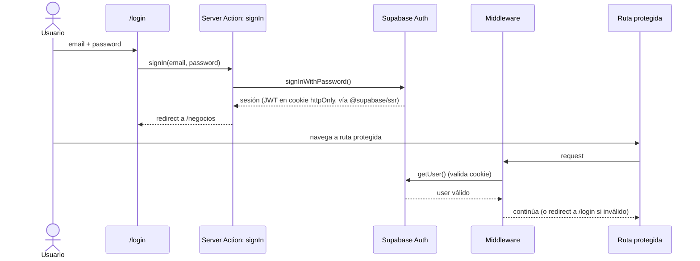

# Backend Architecture

## Service Architecture

No aplica el patrón serverless de funciones independientes ni el de controladores/rutas tradicionales tal como el template genérico los describe — Next.js Server Actions es un tercer modelo: **funciones marcadas `"use server"`, colocadas junto al dominio que implementan, invocadas por RPC implícito desde el cliente**. Vercel las despliega como funciones serverless individuales por debajo, pero el código de aplicación no gestiona esa capa directamente.

**Server Actions Organization:**
```text
apps/web/src/actions/
├── auth/            (signUp, signIn, signOut)
├── negocios/         (crearNegocio, archivarNegocio, listarNegocios)
├── catalogos/        (crear/listar Moneda, TipoGasto — por ámbito)
├── inventario/        (crearItem, registrarCompra, obtenerValorInventario)
├── ventas/           (registrarVenta, cancelarVenta, registrarPagoCxC)
├── gastos/            (registrarGasto, registrarPagoResumenTarjeta)
├── cuentas-financieras/ (crearCuentaFinanciera, obtenerSaldos)
├── indicadores/       (obtenerIndicadores)
├── consolidado/       (obtenerDashboardConsolidado)
└── personal/          (registrarRetiro, configurarReglaRetiro, registrarGastoPersonal, obtenerBalancePersonal)
```

**Server Action Template:**
```typescript
// actions/ventas/registrar-venta.ts
"use server";

import { registrarVentaSchema } from "@repo/domain/schemas";
import { withRlsContext } from "@repo/database";
import { getCurrentAccount } from "@/lib/auth";
import { revalidatePath } from "next/cache";

export async function registrarVenta(
  negocioId: string,
  input: unknown
): Promise<Result<Venta, ApiError>> {
  const cuenta = await getCurrentAccount();
  if (!cuenta) return err({ code: "UNAUTHENTICATED", message: "Sesión requerida" });

  const parsed = registrarVentaSchema.safeParse(input);
  if (!parsed.success) return err({ code: "VALIDATION", message: parsed.error.message });

  const result = await withRlsContext(cuenta.id, negocioId, async (tx) => {
    // ... lógica de negocio: insertar venta, venta_items, actualizar stock, CxC
  });

  revalidatePath(`/laboral/dashboard`);
  return ok(result);
}
```

## Database Architecture

**Schema Design:** ver "Database Schema" arriba (fuente de verdad completa).

**Data Access Layer — el mecanismo `withRlsContext`:**

Esta es la pieza más crítica de todo el backend: convierte el requisito de negocio (NFR1/NFR2) en un mecanismo que el código no puede accidentalmente saltarse.

```typescript
// packages/database/src/rls-context.ts
import { PrismaClient } from "@prisma/client";

const prisma = new PrismaClient(); // conectado como `app_user` (NOBYPASSRLS) — ver Database Schema

export async function withRlsContext<T>(
  cuentaId: string,
  negocioId: string | null,   // null = solo Personal; nunca "*" desde una Server Action
  fn: (tx: Prisma.TransactionClient) => Promise<T>
): Promise<T> {
  return prisma.$transaction(async (tx) => {
    // Replica el claim que Supabase Auth le pasaría a auth.uid() vía PostgREST.
    await tx.$executeRawUnsafe(
      `select set_config('request.jwt.claims', $1, true)`,
      JSON.stringify({ sub: cuentaId, role: "authenticated" })
    );
    if (negocioId) {
      await tx.$executeRawUnsafe(
        `select set_config('app.active_negocio_id', $1, true)`,
        negocioId
      );
    }
    return fn(tx);
  });
}

// Variante exclusiva de lectura consolidada — SOLO invocable desde
// actions/consolidado/*. No exportada desde el índice público del paquete;
// se importa con una ruta explícita para que sea evidente en code review.
export async function withRlsContextConsolidado<T>(
  cuentaId: string,
  fn: (tx: Prisma.TransactionClient) => Promise<T>
): Promise<T> {
  return prisma.$transaction(async (tx) => {
    await tx.$executeRawUnsafe(
      `select set_config('request.jwt.claims', $1, true)`,
      JSON.stringify({ sub: cuentaId, role: "authenticated" })
    );
    await tx.$executeRawUnsafe(`select set_config('app.active_negocio_id', '*', true)`);
    return fn(tx); // SOLO queries de lectura — se audita en code review, no técnicamente forzado
  });
}
```

**Por qué `app_user` con `NOBYPASSRLS` es obligatorio:** el rol `postgres` (superuser) y `service_role` de Supabase **ignoran RLS por diseño** — son para tareas administrativas. Si `DATABASE_URL` de Prisma apuntara a cualquiera de esos roles, todas las políticas de este documento serían decorativas. `DATABASE_URL` (runtime de la app) usa `app_user`; una `DIRECT_URL` separada, con el rol de owner del schema, se usa **solo** para `prisma migrate deploy` en CI/CD — nunca en el código de la aplicación.

## Authentication and Authorization

**Auth Flow:**


**Middleware/Guards:** ver "Protected Route Pattern" en Frontend Architecture — la misma verificación de sesión sirve para RSC y para Server Actions (`getCurrentAccount()` reutiliza el mismo cliente de sesión).

## Jobs Programados (Cierre de Período)

**Contexto (ADR-001):** FR26 (Story 6.2 AC2, regla de retiro predeterminado) y FR31 (Story 6.5, aporte periódico a la reserva financiera) requieren que el sistema genere movimientos **sin intervención manual "al cierre de cada período"**. Esto es distinto del cálculo de indicadores (NFR4: siempre on-read, nunca batch) — acá el sistema necesita *escribir* una transacción (`RetiroUtilidad`) o actualizar un acumulado (`ReservaFinanciera.progresoAcumulado`) sin que haya un usuario haciendo la petición. El Tech Stack no tenía documentado ningún mecanismo de job/cron; esta sección lo resuelve.

**Mecanismo elegido: Vercel Cron Jobs** (nativo de la misma plataforma de despliegue — sin agregar infraestructura nueva, consistente con el criterio de "IaC N/A para MVP" del Tech Stack).

**Por qué no Supabase `pg_cron`:** la lógica de negocio (cálculo de monto por regla, actualización de saldo, generación del `RetiroUtilidad`) ya vive en TypeScript (`packages/domain`) y se reutiliza desde las Server Actions manuales (`registrarRetiro`, `configurarReglaRetiro`). Duplicarla en PL/pgSQL para `pg_cron` rompería la regla de una sola fuente de verdad para lógica de dominio (ver Coding Standards) y no sería testeable con el mismo Vitest suite que el resto del sistema.

**Configuración (`vercel.json`, raíz del repo):**
```json
{
  "crons": [
    { "path": "/api/cron/cierre-periodo", "schedule": "0 6 * * *" }
  ]
}
```
Corre diariamente a las 06:00 UTC (~03:00 America/Asuncion, fuera de horario de uso). El período soportado en MVP es exclusivamente `MENSUAL` (ver `ReglaRetiro.periodo` / `ReservaFinanciera.periodo`), así que el job es un no-op salvo que la fecha de ejecución sea el **último día calendario del mes** — no hay campo de "día de cierre" configurable por negocio en el modelo de datos actual.

**Route Handler (segundo endpoint REST del sistema, junto al health check — ver API Specification):**
```typescript
// apps/web/src/app/api/cron/cierre-periodo/route.ts
import { NextRequest, NextResponse } from "next/server";
import { esUltimoDiaDelMes, periodoActual } from "@repo/domain/periodo";
import { ejecutarCierreDePeriodo } from "@repo/domain/personal/cierre-periodo";

export async function GET(req: NextRequest) {
  // Vercel firma automáticamente los crons con este header — ver Deployment Architecture (env CRON_SECRET)
  const auth = req.headers.get("authorization");
  if (auth !== `Bearer ${process.env.CRON_SECRET}`) {
    return new NextResponse("Unauthorized", { status: 401 });
  }

  if (!esUltimoDiaDelMes(new Date())) {
    return NextResponse.json({ status: "skip", reason: "not-period-close-day" });
  }

  const periodo = periodoActual(); // 'YYYY-MM'
  const resultado = await ejecutarCierreDePeriodo(periodo);
  // ejecutarCierreDePeriodo (packages/domain) itera:
  //  1. Negocios con ReglaRetiro.activa = true y ultimoPeriodoAplicado != periodo
  //     → calcula monto (PORCENTAJE|MONTO_FIJO), inserta RetiroUtilidad(origen='REGLA'),
  //       aplica el mismo movimiento de caja/banco que el retiro manual, y hace
  //       UPDATE regla_retiro SET ultimo_periodo_aplicado = periodo — TODO en una
  //       transacción withRlsContext por negocio (NUNCA con bypass '*' de escritura).
  //  2. ReservaFinanciera de cada cuenta con aportePorPeriodo > 0 y
  //     ultimoPeriodoAplicado != periodo → progresoAcumulado += aportePorPeriodo,
  //     UPDATE ultimo_periodo_aplicado = periodo.

  return NextResponse.json({ status: "ok", periodo, ...resultado });
}
```

**Idempotencia:** Vercel Cron puede reintentar una invocación que no responde a tiempo. La guarda es a nivel de dato, no de infraestructura: cada `ReglaRetiro`/`ReservaFinanciera` solo se procesa si `ultimo_periodo_aplicado <> periodo_actual` (o es `null`), dentro de la misma transacción que hace el `UPDATE` de esa columna — dos invocaciones concurrentes del mismo período no pueden generar dos retiros duplicados.

**Aislamiento:** el job recorre negocios de múltiples cuentas, pero cada retiro/aporte individual se ejecuta con `withRlsContext(cuentaId, negocioId, fn)` — exactamente el mismo mecanismo que usan las Server Actions manuales (ver "Database Architecture" arriba). El job **no** usa `withRlsContextConsolidado` (ese bypass `'*'` es solo de lectura, ver nota 4 de Database Schema); en su lugar itera negocio por negocio, cada uno con su propio contexto RLS de escritura.

**Story de referencia:** este mecanismo cubre Story 6.2 (retiro automático) y Story 6.5 (aporte automático a reserva) — ver Dev Notes de ambas stories para la cita puntual.

---
