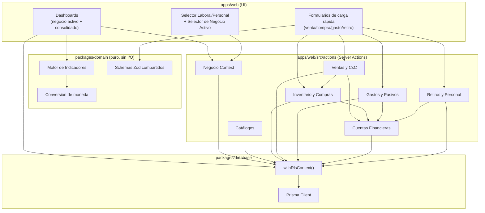

# Components

## Auth & Session

**Responsibility:** Registro, login, logout, gestión de sesión (FR1, FR2, NFR9). Wrapper delgado sobre Supabase Auth vía `@supabase/ssr`.

**Key Interfaces:**
- `signUp(email, password)`, `signIn(email, password)`, `signOut()`
- `getCurrentAccount()` — resuelve la `Cuenta` autenticada desde la cookie de sesión

**Dependencies:** Supabase Auth
**Technology Stack:** `@supabase/ssr` + Next.js Middleware

## Negocio Context

**Responsibility:** Gestión de negocios (alta, archivo, selector activo — FR3-FR6) y resolución del `negocioId` activo por request.

**Key Interfaces:**
- `crearNegocio`, `archivarNegocio`, `listarNegocios`
- Store de Zustand `useNegocioActivoStore` (persistido en `localStorage`) — fuente de verdad de UI para qué negocio está seleccionado

**Dependencies:** Auth & Session, Database Access Layer
**Technology Stack:** Server Actions + Zustand

## Catálogos (Monedas / Tipos de Gasto)

**Responsibility:** CRUD de los dos catálogos configurables por negocio y Personal (FR7-FR10), con la clasificación obligatoria (NFR7).

**Dependencies:** Negocio Context
**Technology Stack:** Server Actions + Prisma

## Inventario y Compras

**Responsibility:** Alta de ítems (Producto/Servicio), registro de compras, mantenimiento de stock valorizado (FR11-FR13, Epic 2).

**Key Interfaces:** `crearItem`, `registrarCompra`, `obtenerValorInventario`
**Dependencies:** Catálogos (moneda), Cuentas Financieras (saldo/deuda de tarjeta)

## Ventas y Cuentas por Cobrar

**Responsibility:** Registro de ventas mixtas producto/servicio, cancelaciones/devoluciones, cuentas por cobrar (Epic 3).

**Key Interfaces:** `registrarVenta`, `cancelarVenta`, `registrarPagoCxC`
**Dependencies:** Inventario (stock), Cuentas Financieras, Motor de Indicadores (consumidor de sus eventos)

## Gastos y Pasivos

**Responsibility:** Registro de gastos clasificados, deuda de tarjeta/cuentas por pagar (Epic 4).

**Key Interfaces:** `registrarGasto`, `registrarPagoResumenTarjeta`
**Dependencies:** Catálogos (tipo de gasto), Cuentas Financieras

## Cuentas Financieras (Caja/Banco/Tarjeta)

**Responsibility:** Saldo/deuda por cuenta financiera y por moneda (FR19, FR20, FR33), ledger de movimientos.

**Key Interfaces:** `obtenerSaldos`, `crearCuentaFinanciera`
**Dependencies:** Catálogos (moneda)
**Nota:** es el componente más "compartido" — casi todos los demás lo invocan para mover saldo. Se diseña con una única función de escritura (`aplicarMovimiento`) para que el ledger sea siempre la única vía de mutación de saldo, evitando estados inconsistentes.

## Motor de Indicadores (Financial Engine)

**Responsibility:** Cálculo de la cadena completa de indicadores (Story 5.1) y consolidación multi-negocio/multi-moneda (Story 5.4). **Vive en `packages/domain` como funciones puras** — no toca la base de datos directamente, recibe los datos ya leídos y devuelve los indicadores calculados.

**Key Interfaces:**
```typescript
calcularIndicadores(datos: DatosPeriodoNegocio): IndicadoresFinancieros;
consolidarIndicadores(indicadoresPorNegocio: IndicadoresFinancieros[], tasas: TasaCambio[]): IndicadoresConsolidados;
convertirAMoneda(monto: string, tasaCambio: TasaCambio | null): string;
```

**Dependencies:** ninguna de infraestructura (por diseño — ver "Architectural Patterns: Domain Package Puro")
**Technology Stack:** TypeScript puro, testeado con Vitest (mayor densidad de tests unitarios de todo el sistema)

## Retiros y Módulo Personal

**Responsibility:** Puente Negocio → Personal (retiro manual y regla predeterminada, FR25-FR27), gastos personales, tarjeta personal, reserva financiera, balance personal (Epic 6).

**Dependencies:** Cuentas Financieras (de ambos ámbitos), Motor de Indicadores (ganancia líquida disponible para retiro)

## Component Diagrams



---
