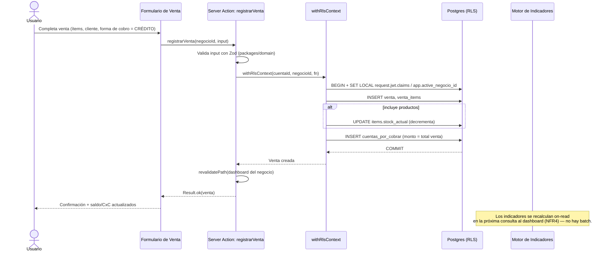
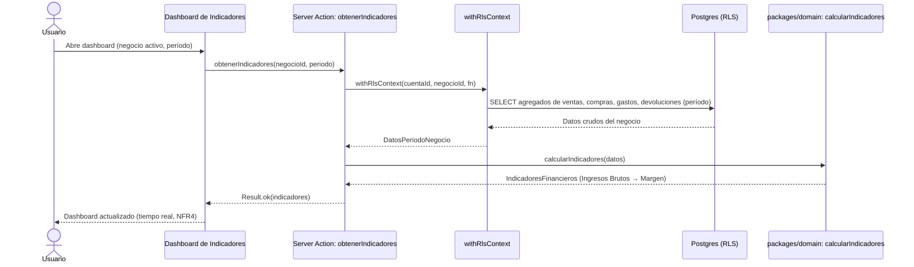
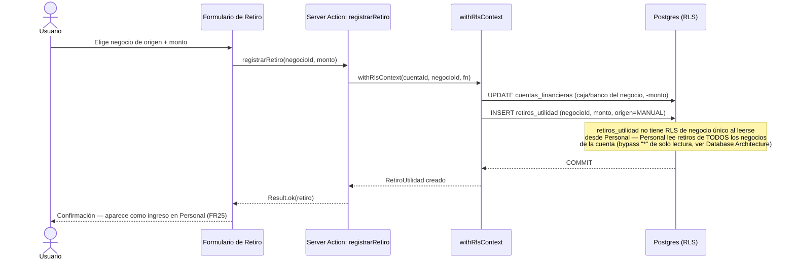
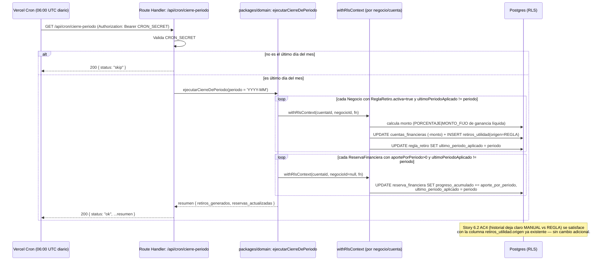
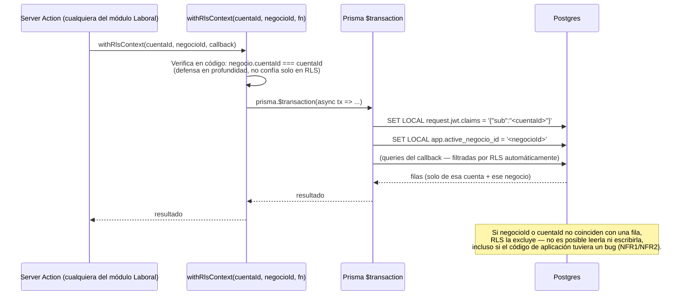

# Core Workflows

## Registro de venta a crédito (con actualización de stock, CxC y saldo)

## Cálculo de indicadores financieros (lectura, negocio activo)

## Retiro de utilidades (negocio → Personal)

## Cierre de período automático (retiro por regla + aporte a reserva) — ADR-001

## Contexto de aislamiento por request (negocio + cuenta)

---
