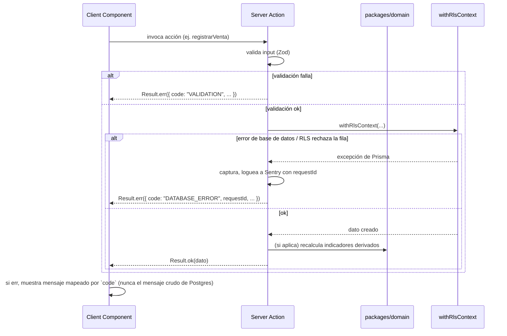

# Error Handling Strategy

## Error Flow



## Error Response Format

```typescript
interface ApiError {
  code: "VALIDATION" | "UNAUTHENTICATED" | "FORBIDDEN" | "NOT_FOUND" | "DATABASE_ERROR" | "UNKNOWN";
  message: string;          // mensaje seguro para mostrar al usuario, nunca el error crudo de Postgres/Prisma
  details?: Record<string, unknown>;
  requestId: string;        // correlaciona con el log de Sentry
  timestamp: string;
}

// Toda Server Action retorna este tipo en vez de lanzar:
type Result<T, E = ApiError> = { ok: true; data: T } | { ok: false; error: E };
```

## Frontend Error Handling

```typescript
// lib/handle-action-result.ts
export function handleActionResult<T>(result: Result<T>): T {
  if (!result.ok) {
    toast.error(mapErrorCodeToMessage(result.error.code)); // nunca result.error.message crudo si viene de DATABASE_ERROR
    throw result.error; // permite que React Query lo capture como error de mutación
  }
  return result.data;
}
```

## Backend Error Handling

```typescript
// lib/server-action-wrapper.ts
export function withErrorHandling<Args extends unknown[], T>(
  fn: (...args: Args) => Promise<T>
) {
  return async (...args: Args): Promise<Result<T>> => {
    const requestId = crypto.randomUUID();
    try {
      return { ok: true, data: await fn(...args) };
    } catch (e) {
      Sentry.captureException(e, { tags: { requestId } });
      return {
        ok: false,
        error: {
          code: e instanceof ZodError ? "VALIDATION" : "DATABASE_ERROR",
          message: "Ocurrió un error al procesar la operación. Intentá nuevamente.",
          requestId,
          timestamp: new Date().toISOString(),
        },
      };
    }
  };
}
```

---
