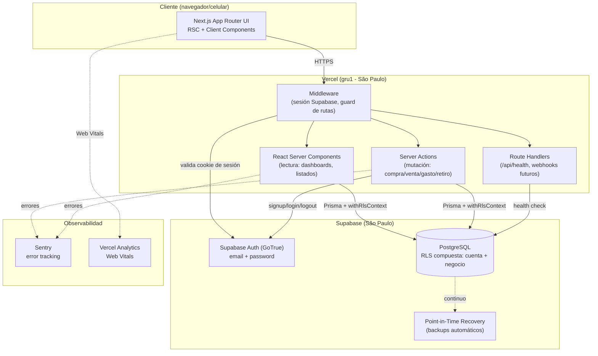

# High Level Architecture

## Technical Summary

El sistema es un **monolito modular** implementado como una única aplicación **Next.js 15 (App Router)** con **Server Actions** como capa de mutación primaria, desplegado en **Vercel**, contra una base de datos **PostgreSQL gestionada por Supabase**. Supabase provee además **autenticación** (email/contraseña) y respaldos automáticos. El frontend usa **React Server Components** por defecto y componentes cliente solo donde hay interactividad real (formularios de carga rápida, selector de negocio activo), con **Zustand** para estado de UI efímero (negocio activo, ámbito Laboral/Personal) y **React Query** para estado de servidor (dashboards, listados). El punto de integración crítico entre frontend y backend no es una API REST separada, sino **Server Actions tipadas de extremo a extremo** (mismo `packages/domain` compartido de tipos y validación Zod), lo que elimina una clase entera de bugs de desincronización de contratos. La pieza arquitectónica central que resuelve los NFR1/NFR2 del PRD (aislamiento entre cuentas y entre negocios "a nivel de consulta/base de datos, no solo de interfaz") es un esquema de **Row-Level Security (RLS) compuesta de Postgres**: cada consulta corre dentro de una transacción que fija dos variables de sesión —identidad de cuenta (equivalente a `auth.uid()`) y negocio activo— y las políticas RLS de cada tabla las exigen ambas. Esta arquitectura cumple la promesa central del PRD (indicadores financieros por negocio y consolidados, en tiempo real, sin cálculo manual) manteniendo la superficie operativa mínima adecuada para un producto de uso propio de bajo-medio volumen transaccional.

## Platform and Infrastructure Choice

El PRD fija: monolito modular, Next.js App Router + Server Actions, PostgreSQL relacional con integridad ACID (NFR8), aislamiento a nivel de DB (NFR1/NFR2), backups periódicos (NFR3), autenticación individual (NFR9), sin integraciones de pago ni bancarias. Con esos requisitos, se evaluaron:

| Opción | Pros | Contras |
|---|---|---|
| **Vercel + Supabase** | Soporte nativo de primera clase para Next.js (Server Actions, RSC, edge/regional functions); Postgres gestionado con RLS nativo y `auth.uid()` listo para usar; Auth gestionado con backups automáticos (cubre NFR3 sin trabajo extra); tier gratuito/bajo costo adecuado a volumen bajo-medio; cero overhead operativo para un desarrollador solo. | Vendor lock-in moderado (mitigado: Postgres estándar, se puede migrar); límites de cold-start en el tier gratuito (aceptable, NFR4 pide tiempo real interactivo, no SLA de alta concurrencia). |
| **AWS Full Stack** (Lambda + API Gateway + RDS + Cognito) | Máximo control, escala a nivel empresarial. | Sobreingeniería clara para este volumen; RLS compuesta y `auth.uid()` habría que reconstruirlos a mano sobre Cognito; semanas de setup de infraestructura que el MVP no justifica (violación directa del principio "Pragmatic Technology Selection"). |
| **Railway** (Postgres + Next.js en un solo servicio) | Muy simple, un solo proveedor, Postgres administrado. | Sin RLS/Auth nativos integrados con el framework — habría que construir la capa de autenticación y el mecanismo de `auth.uid()`-equivalente desde cero, replicando trabajo que Supabase ya resuelve. |

**Decisión: Vercel + Supabase.** Es la única opción donde el mecanismo de aislamiento exigido por NFR1/NFR2 (RLS a nivel de base de datos) viene resuelto por la plataforma en vez de construido a mano, y donde el backup de NFR3 es gratis por configuración. Se confirma como elección explícita de este documento — el PRD dejaba esta decisión abierta para @architect.

**Platform:** Vercel (hosting Next.js, Server Actions, funciones regionales) + Supabase (PostgreSQL, Auth, backups)
**Key Services:** Vercel (Edge Network, Serverless/Node Functions), Supabase Postgres, Supabase Auth (GoTrue), Supabase Point-in-Time Recovery (backups)
**Deployment Host and Regions:** Vercel función pineada a `gru1` (São Paulo) — región más cercana a Paraguay disponible en Vercel; proyecto Supabase en la región **South America (São Paulo)** por la misma razón. Minimiza latencia de escritura de transacciones financieras interactivas (NFR10: <1 min por operación).

## Repository Structure

**Structure:** Monorepo (según lo fijado en el PRD — Technical Assumptions), implementado con **npm workspaces**, sin Turborepo/Nx.

**Rationale:** el PRD pide monorepo para "compartir tipos entre validación de formularios y las fórmulas financieras". Como todo el sistema vive en **una sola aplicación Next.js** (no hay un backend separado desplegado aparte — Server Actions corren dentro del mismo proceso Next.js), no hay necesidad de orquestar builds de múltiples apps con Turborepo/Nx: eso sería complejidad de tooling sin un problema real que resolver a este tamaño (principio "Pragmatic Technology Selection" — tecnología aburrida donde alcanza). npm workspaces da exactamente lo que se necesita: paquetes internos (`packages/domain`, `packages/database`) importables desde `apps/web` con TypeScript project references, sin build orchestration adicional. Si el proyecto creciera a múltiples apps desplegables por separado, migrar a Turborepo es un cambio mecánico, no una reescritura.

**Monorepo Tool:** npm workspaces
**Package Organization:**
- `apps/web` — la aplicación Next.js completa (UI + Server Actions + Route Handlers). Es el único artefacto desplegado.
- `packages/domain` — lógica de negocio pura, sin dependencias de framework: fórmulas de indicadores financieros (Story 5.1), conversión de moneda, tipos TypeScript compartidos, esquemas de validación Zod. 100% testeable de forma aislada — exactamente el área que el PRD marca como de mayor riesgo ("Testing Requirements": fórmulas financieras con cobertura exhaustiva de casos límite).
- `packages/database` — schema de Prisma, cliente generado, y la capa de acceso a datos con el wrapper de contexto RLS (`withRlsContext`, ver Backend Architecture).

## High Level Architecture Diagram

## Architectural Patterns

- **Monolito Modular (Modular Monolith):** una única aplicación desplegable, organizada internamente por módulos de dominio (Negocios, Catálogos, Inventario, Ventas, Gastos, Indicadores, Personal) con fronteras de import explícitas. — _Rationale:_ el volumen bajo-medio del brief y el equipo de un solo desarrollador no justifican el costo operativo de microservicios; un monolito bien modularizado da la mayoría de los beneficios de aislamiento sin el costo de una red distribuida.
- **Server Actions como capa de mutación (BFF implícito):** toda escritura (compra, venta, gasto, retiro) pasa por una Server Action tipada, nunca por un cliente HTTP genérico desde el navegador. — _Rationale:_ elimina la necesidad de mantener contratos OpenAPI/tRPC separados; el tipo de la función *es* el contrato, compartido en tiempo de compilación entre UI y backend.
- **RLS Compuesta (Composite Row-Level Security):** aislamiento de datos impuesto por Postgres mediante dos variables de sesión por transacción — identidad de cuenta y negocio activo — no solo por `WHERE` en el código de aplicación. — _Rationale:_ es la única forma de satisfacer literalmente NFR1/NFR2 ("a nivel de consulta/base de datos, no solo de interfaz"); un bug de aplicación que olvide un filtro no puede filtrar datos entre cuentas o negocios, porque Postgres lo rechaza antes de devolver filas.
- **Domain Package Puro (Functional Core):** las fórmulas de indicadores financieros y conversión de moneda viven en `packages/domain`, sin I/O ni dependencias de Next.js/Prisma — reciben datos, devuelven números. — _Rationale:_ es el área de mayor riesgo del PRD; aislarla de infraestructura permite tests unitarios rápidos y exhaustivos de casos límite sin levantar base de datos.
- **Repository Pattern con Contexto Obligatorio:** toda lectura/escritura del módulo Laboral pasa por funciones de `packages/database` que exigen un `negocio_id` de contexto — no existe una ruta de código que consulte una tabla transaccional sin pasar por `withRlsContext`. — _Rationale:_ hace estructuralmente imposible (no solo "por convención") que una Server Action olvide el filtro de negocio.
- **Optimistic UI + Revalidation:** mutaciones vía Server Actions seguidas de `revalidatePath`/`revalidateTag`; React Query gestiona estado de servidor en las vistas que lo necesitan (dashboards con filtros) con `staleTime` corto. — _Rationale:_ NFR4 exige indicadores en tiempo real sin batch nocturno; revalidar por path es más simple que un sistema de eventos para este volumen.

---
