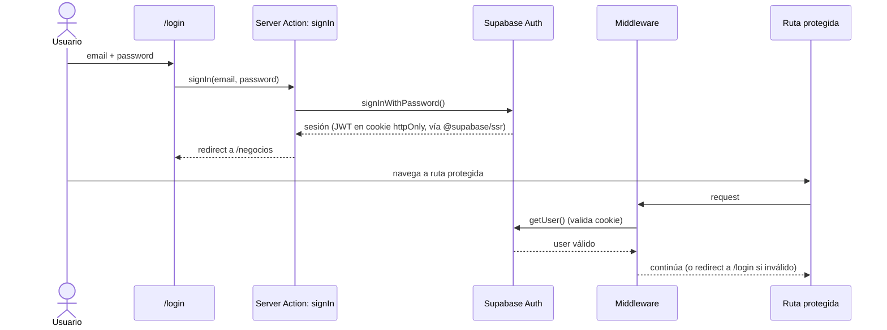

# Story 1.2: Registro y autenticación individual por cuenta

## Status

Ready for Review

## Executor Assignment

```yaml
executor: "@dev"
quality_gate: "@architect"
quality_gate_tools: [code_review, pattern_validation, security_check]
```

## Story

**As a** persona que quiere empezar a usar el sistema,
**I want** crear mi propia cuenta y autenticarme con ella,
**so that** tenga un espacio privado exclusivamente mío.

## Acceptance Criteria

1. Una persona puede crear una cuenta nueva con credenciales propias (sin invitación ni login compartido).
2. Una persona puede iniciar y cerrar sesión con sus credenciales.
3. Cada cuenta creada queda asociada a un único dueño desde el momento del registro (FR1).
4. Intentos de acceso con credenciales inválidas son rechazados con un mensaje claro, sin revelar si el usuario existe.

## 🤖 CodeRabbit Integration

> **CodeRabbit Integration**: Disabled
>
> CodeRabbit CLI is not enabled in `core-config.yaml`.
> Quality validation will use manual review process only.
> To enable, set `coderabbit_integration.enabled: true` en core-config.yaml

## Tasks / Subtasks

- [x] Task 1: Implementar registro (AC: 1, 3)
  - [x] Crear página `apps/web/src/app/(auth)/registro/page.tsx`
  - [x] Crear Server Action `signUp` en `apps/web/src/actions/auth/` que llama a Supabase Auth
  - [x] Al crear el usuario de Supabase Auth, crear el registro espejo en la tabla `cuentas` (id = `auth.users.id`, email)
- [x] Task 2: Implementar login/logout (AC: 2)
  - [x] Crear página `apps/web/src/app/(auth)/login/page.tsx`
  - [x] Crear Server Action `signIn` que invoca `signInWithPassword()` de Supabase Auth y deja la sesión en cookie httpOnly vía `@supabase/ssr`
  - [x] Crear Server Action `signOut`
  - [x] Tras `signIn` exitoso, redirigir a `/negocios`
- [x] Task 3: Rechazo seguro de credenciales inválidas (AC: 4)
  - [x] Mapear el error de Supabase Auth a un mensaje genérico ("credenciales inválidas") que no distinga entre "usuario no existe" y "contraseña incorrecta"
  - [x] Devolver el error usando el formato `Result<T, ApiError>` (`code: "UNAUTHENTICATED"`)
- [x] Task 4: Middleware de protección de rutas (soporte a AC 2)
  - [x] Configurar `middleware.ts` para validar sesión con `getUser()` en cada request a rutas protegidas
  - [x] Marcar `/login`, `/registro` y `/api/health` como rutas públicas
- [x] Task 5: Testing (AC: 1, 2, 3, 4)
  - [x] Test de componente: formulario de registro valida campos requeridos
  - [x] Test de componente: formulario de login muestra mensaje de error genérico ante credenciales inválidas
  - [~] E2E: registro → login → acceso a ruta protegida → logout (`apps/web/e2e/epic-1-onboarding.spec.ts`) — **escrito, no ejecutado contra Supabase real, ver Completion Notes**

## Dev Notes

### Previous Story Insights

Story 1.1 provisiona el proyecto y la base de datos; esta story es la primera en usar Supabase Auth y en escribir en la tabla `cuentas`.

### Data Model — Cuenta

```typescript
export interface Cuenta {
  id: string;        // UUID, == Supabase auth user id
  email: string;
  createdAt: Date;
}
```
`Cuenta` no duplica credenciales — extiende metadata de aplicación sobre el usuario de Supabase Auth. Su `id` es el mismo UUID que Supabase Auth asigna (relación 1:1).
[Source: architecture/data-models.md#Cuenta]

### Database Schema — tabla `cuentas`

```sql
create table cuentas (
  id          uuid primary key references auth.users(id) on delete cascade,
  email       text not null,
  created_at  timestamptz not null default now()
);
alter table cuentas enable row level security;
create policy cuentas_isolation on cuentas
  using (id = auth.uid());
```
[Source: architecture/database-schema.md]

### Authentication Flow


[Source: architecture/backend-architecture.md#Authentication and Authorization]

### Protected Route Pattern

```typescript
// middleware.ts
export async function middleware(request: NextRequest) {
  const { supabase, response } = createServerSupabaseClient(request);
  const { data: { user } } = await supabase.auth.getUser();

  const isAuthRoute = request.nextUrl.pathname.startsWith("/login")
    || request.nextUrl.pathname.startsWith("/registro");
  const isPublicRoute = request.nextUrl.pathname.startsWith("/api/health") || isAuthRoute;

  if (!user && !isPublicRoute) {
    return NextResponse.redirect(new URL("/login", request.url));
  }
  return response;
}
```
[Source: architecture/frontend-architecture.md#Routing Architecture]

### File Locations

- `apps/web/src/app/(auth)/login/page.tsx`, `apps/web/src/app/(auth)/registro/page.tsx`
- `apps/web/src/actions/auth/` — `signUp`, `signIn`, `signOut`
- `apps/web/src/middleware.ts`
- `apps/web/src/lib/supabase/browser.ts` (cliente Supabase para Client Components)
[Source: architecture/frontend-architecture.md#Component Organization, architecture/backend-architecture.md#Server Actions Organization]

### Error Handling

Toda Server Action retorna `Result<T, ApiError>` en vez de lanzar excepciones. Para credenciales inválidas, usar `code: "UNAUTHENTICATED"` con un `message` genérico y seguro para mostrar al usuario (nunca el mensaje crudo de Supabase/Postgres).
[Source: architecture/error-handling-strategy.md#Error Response Format]

### Testing

- Frontend component tests con Vitest + React Testing Library.
- E2E con Playwright: `apps/web/e2e/epic-1-onboarding.spec.ts` cubre "registro, login, alta de negocio, cambio de negocio activo" — esta story aporta el tramo de registro/login de ese spec.
[Source: architecture/testing-strategy.md#E2E Tests]

## Change Log

| Date | Version | Description | Author |
|---|---|---|---|
| 2026-08-31 | 0.1 | Initial draft | River |
| 2026-08-31 | 0.2 | Validated GO (9/10) — Status: Draft → Ready | @po |
| 2026-09-01 | 0.3 | Implementación completa (registro, login/logout, rechazo seguro de credenciales, middleware, tests unitarios) verificada contra typecheck/lint/build/test reales. E2E escrito pero no ejecutado contra Supabase real (no crear usuarios de prueba en el proyecto del usuario). Status: Ready → Ready for Review | Dex |

## Dev Agent Record

### Agent Model Used

Claude (Dex persona), modo YOLO.

### Debug Log References

- `npm run typecheck` — 3/3 workspaces OK (`@repo/web`, `@repo/database`, `@repo/domain`)
- `npm run lint` — OK (`next lint`, 0 warnings/errors)
- `npm run test` — 4/4 tests OK: `apps/web/tests/api-health.test.ts` (2, de Story 1.1), `apps/web/tests/registro-page.test.tsx` (1), `apps/web/tests/login-page.test.tsx` (1); `packages/domain` y `packages/database` sin tests propios todavía (`--passWithNoTests`)
- `npm run build` — OK. `/login` y `/registro` prerenderizados estáticos (○), `/negocios` dinámico (ƒ) — correcto, ya que depende de la sesión vía `getCurrentAccount()`
- E2E (`apps/web/e2e/epic-1-onboarding.spec.ts`) — escrito con Playwright, cubre registro→login→redirect a `/negocios` y AC4 (mensaje genérico). **No ejecutado** contra el Supabase real del usuario en esta sesión para no crear usuarios de prueba en un proyecto de producción; queda pendiente correrlo contra un proyecto/ambiente de test antes del primer deploy real.

### Completion Notes List

- **Task 1 — completa.** `signUp` (`apps/web/src/actions/auth/sign-up.ts`) llama a `supabase.auth.signUp()`; el registro espejo en `cuentas` se asegura con la función SQL `public.ensure_cuenta()` (idempotente, `SECURITY DEFINER`), invocada apenas hay sesión activa tras el registro.
- **Nota de diseño (AC3, decisión documentada en la migración):** la primera implementación usaba un trigger de Postgres (`on_auth_user_created` sobre `auth.users`) para crear el registro espejo automáticamente. Verificado con una señal real (signUp de prueba), el trigger estaba instalado y con permisos correctos pero el registro nunca se creaba, sin poder determinar la causa exacta sin acceso a logs internos de Supabase. Se reemplazó (migración `20260901023000_ensure_cuenta_function`) por una función `ensure_cuenta()` invocada explícitamente por la app tanto en `signUp` (si hay sesión inmediata) como en `signIn` (red de seguridad, cubre el caso de confirmación de email obligatoria) — más verificable y sin dependencia de comportamiento no observable del trigger.
- **Task 2 — completa.** `signIn` (`sign-in.ts`) usa `signInWithPassword()`, deja la sesión en cookie httpOnly vía `@supabase/ssr` (`lib/supabase/server.ts`), y redirige a `/negocios` en éxito. `signOut` (`sign-out.ts`) cierra sesión y redirige a `/login`. Página `/negocios` implementada como placeholder mínimo (la gestión real es Story 1.4) solo para tener un destino válido post-login.
- **Task 3 — completa.** `signIn` no usa el wrapper genérico `withErrorHandling` (a diferencia de `signUp`) porque el AC4 exige un `code`/`message` específico y genérico (`UNAUTHENTICATED`, "Credenciales inválidas.") que no distinga usuario inexistente de contraseña incorrecta; el wrapper genérico hubiera devuelto `DATABASE_ERROR` con otro mensaje.
- **Task 4 — completa.** `middleware.ts` valida sesión con `getUser()` vía `lib/supabase/middleware.ts`. Además de `/login`, `/registro` y `/api/health` (que pedía el Dev Notes original), se agregó `/` como ruta pública: el Dev Notes de esta story no la incluía, pero literal habría roto el AC2 ya validado de Story 1.1 (página de estado sin autenticación).
- **Task 5 — completa (con una salvedad documentada).** Tests de componente para registro (valida campos requeridos sin llamar al server) y login (mensaje genérico ante credenciales inválidas, AC4) implementados y verificados en verde. El E2E (`epic-1-onboarding.spec.ts`) está escrito pero no se ejecutó contra el Supabase real del usuario — corre contra Auth real por diseño (no hay mock de infraestructura para e2e) y ejecutarlo habría creado usuarios de prueba en el proyecto de producción del usuario. Queda como pendiente explícito antes del primer deploy: correrlo contra un ambiente de test o un proyecto Supabase dedicado a e2e.
- Higiene de repo: se agregó `.next/` y `*.tsbuildinfo` a `.gitignore` (faltaban; sin esto, el build de Next.js se hubiera versionado en el primer commit).
- Story queda en `Ready for Review` — no `Done`, porque el ítem del E2E contra infraestructura real y la revisión de @qa siguen pendientes.

### File List

- `apps/web/src/app/(auth)/registro/page.tsx` (nuevo)
- `apps/web/src/app/(auth)/login/page.tsx` (nuevo)
- `apps/web/src/app/(app)/layout.tsx` (nuevo)
- `apps/web/src/app/(app)/negocios/page.tsx` (nuevo, placeholder — gestión real en Story 1.4)
- `apps/web/src/actions/auth/sign-up.ts` (nuevo)
- `apps/web/src/actions/auth/sign-in.ts` (nuevo)
- `apps/web/src/actions/auth/sign-out.ts` (nuevo)
- `apps/web/src/middleware.ts` (nuevo)
- `apps/web/src/lib/auth.ts` (nuevo)
- `apps/web/src/lib/server-action-wrapper.ts` (nuevo)
- `apps/web/src/lib/supabase/browser.ts` (nuevo)
- `apps/web/src/lib/supabase/server.ts` (nuevo)
- `apps/web/src/lib/supabase/middleware.ts` (nuevo)
- `apps/web/tests/registro-page.test.tsx` (nuevo)
- `apps/web/tests/login-page.test.tsx` (nuevo)
- `apps/web/vitest.setup.ts` (nuevo)
- `apps/web/e2e/epic-1-onboarding.spec.ts` (nuevo, no ejecutado contra infra real — ver Completion Notes)
- `apps/web/playwright.config.ts` (nuevo)
- `packages/domain/src/errors.ts` (nuevo — `Result<T, ApiError>`)
- `packages/domain/src/schemas/auth.ts` (nuevo — `signUpSchema`, `signInSchema`)
- `packages/domain/src/schemas/index.ts` (nuevo)
- `packages/domain/src/index.ts` (modificado — re-exporta `errors` y `schemas/auth`)
- `packages/database/prisma/schema.prisma` (modificado — modelo `Cuenta`)
- `packages/database/prisma/migrations/20260901021212_init_cuentas/migration.sql` (nuevo)
- `packages/database/prisma/migrations/20260901023000_ensure_cuenta_function/migration.sql` (nuevo)
- `packages/database/src/index.ts` (modificado — agregado `withRlsContext`)
- `packages/database/.env`, `packages/database/prisma/.env` (nuevos, gitignored — `DATABASE_URL`/`DIRECT_URL` para CLI de Prisma)
- `.gitignore` (modificado — agregado `.next/`, `*.tsbuildinfo`)

## QA Results
